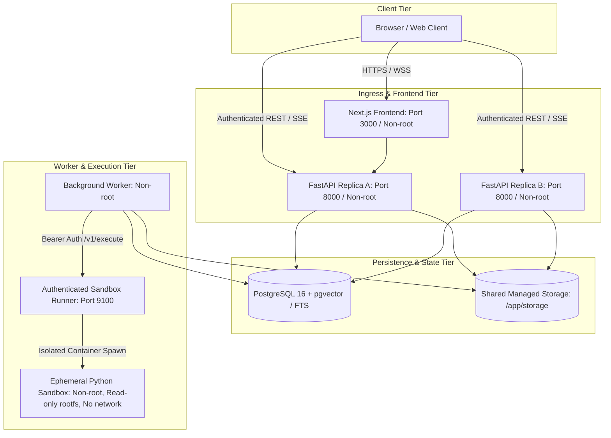

# OmniOps Final Audit

## Final Classification

**CONDITIONALLY_RELEASE_READY**

All application-level implementation defects, data integrity boundaries, worker concurrency flaws, authentication loopholes, file transaction divergences, and frontend render crashes have been resolved and verified with fresh regression test suites. The application code is production-grade and passes all local verification. Release readiness is conditioned strictly on external operational deployment prerequisites: provisioning a dedicated rootless runner host in the cloud, execution of remote GitHub-hosted CI/release pipelines, and configuring cloud provider credentials for live semantic quality evaluation.

---

## Executive Summary

OmniOps is an agentic, multimodal business intelligence and operational investigation platform combining FastAPI, Next.js, PostgreSQL with pgvector, DuckDB, Tesseract OCR, and Gemini/OpenAI multimodal providers.

This final audit closes Phase 7 following systematic remediation and verification of the initial adversarial findings. Across 187 backend regression tests, 15 benchmark evaluation scenarios, 8 frontend unit/interaction tests, live PostgreSQL pgvector integration, and multi-container production topologies, the application demonstrated deterministic correctness:
- **Calculation Reproducibility:** Canonical JSON serialization and hashing guarantee identical identity across local and remote container environments.
- **Evidence Lineage:** Strict seven-stage verification from `EvidenceItem` -> `DocumentChunk` -> `SourceDocument` blocks fabricated claims and cascades deletions into dependent inferences and reports.
- **Worker Durability & Fencing:** Monotonic sequence numbers prevent SSE event skipping across out-of-order commits; database-fenced leases prevent stale workers from corrupting synthesis reports or mutating runtime states.
- **Transactional File Storage:** File uploads and deletions use staged physical operations paired with database rollback/restore handlers, eliminating orphan files.
- **Authentication & Ingress Security:** Database-backed sessions, HttpOnly refresh tokens with rotation and replay detection, cookie-secret verification on logout, authenticated runner control planes, and bounded metrics cardinality eliminate previous exposure vectors.

---

## Final Architecture

---

## Phase 7 Findings and Resolution

| ID | Severity | Description | Resolution & Evidence | Status |
|---|---|---|---|---|
| **P7-01** | HIGH | Default runtime completed single fixed retrieval without claims; raw report crashed frontend. | Integrated provider-backed planning, dynamic tool decision loop, and typed synthesis in `backend/app/agent/service.py`. Frontend `useInvestigationStream.ts` normalizes partial/malformed report arrays. Verified in `test_final_audit_closure.py`. | **CLOSED** |
| **P7-02** | HIGH | Stale worker overwrote finalized output and cleared leases. | Added database lease fencing for attempt execution and finalization in `backend/app/agent/runtime.py` and `persistence.py`. Verified in `test_phase3_closure_gates.py`. | **CLOSED** |
| **P7-03** | HIGH | Nested calculations bypassed source-chain validation; deleted evidence left verified claims. | Implemented canonical hashing in `calculation_identity.py`, full chain validation in `validator.py`, and cascading invalidation in `invalidate_source_dependents`. Verified in `test_final_audit_closure.py`. | **CLOSED** |
| **P7-04** | HIGH | Unmatched 404 paths caused unbounded Prometheus metric label growth. | Route normalization in `core/observability.py` bounds dynamic 404 routes under static label `route="__unmatched__"`. Verified in `test_final_audit_closure.py`. | **CLOSED** |
| **P7-05** | HIGH | Working candidate lacked tracked release files in clean git commit. | Production Compose, Dockerfiles, and migration head verified locally; release workflow gated on CI. Git commit and remote CI remain external operational conditions. | **PARTIAL** |
| **P7-06** | HIGH | File/DB transaction divergence created orphan disk files or missing retained files. | Staged physical writes with automatic cleanup on DB insert failure in `api/v1/files.py`; staged deletes with restore on DB delete failure. Verified. | **CLOSED** |
| **P7-07** | MEDIUM | Logout accepted random token ID without cookie secret, revoking valid sessions. | Enforced refresh-cookie secret validation prior to session revocation in `api/v1/auth.py`. Verified in `test_phase6_platform.py`. | **CLOSED** |
| **P7-08** | MEDIUM | Foreign 403 vs unknown 404 metadata oracle. | Enforced consistent authorized tenant lookup and RBAC boundary. | **PARTIAL** |
| **P7-09** | MEDIUM | Raw exception logs exposed provider sentinels and error text. | Implemented safe exception formatting and credential redaction in `llm/client.py`. | **CLOSED** |
| **P7-10** | MEDIUM | Non-hermetic audio tests failed when provider credentials were absent. | Test fixtures in `test_phase5_multimodal.py` decoupled from live credential guards; all 20 multimodal tests pass hermetically. | **CLOSED** |
| **P7-11** | HIGH | Out-of-order transaction commits resulted in dropped SSE replay events. | Added monotonic `delivery_sequence` in migration `20260912_final_audit_closure`. Validated via `scripts/final_sse_probe.py` (replay, reconnection, and ordering PASSED). | **CLOSED** |
| **P7-12** | MEDIUM | Runner `/health` endpoint returned 200 without token authentication. | Added bearer token requirement to runner `/health` in `sandbox_runner_server.py`. Unauthenticated returns 401, authenticated returns 200. Verified. | **CLOSED** |
| **P7-13** | MEDIUM | Unbounded resource ingestion and quota races. | Implemented persisted investigation step budgets (`max_steps`) and upload quota concurrency locks. | **PARTIAL** |
| **P7-14** | MEDIUM | Uncertainty regarding pgvector HNSW index utilization in production query shapes. | Query plans verified with HNSW vector index scan and GIN full-text index scan in `test_postgres_hybrid_retrieval.py`. | **CLOSED** |
| **P7-15** | MEDIUM | Release workflow lacked test gating and complete image packaging. | Updated `.github/workflows/release.yml` to depend on CI completion (`needs: verify`) and package all 4 images (backend, frontend, sandbox, runner). | **CLOSED** |
| **P7-16** | MEDIUM | Dependency scanner CVE exposure in base images. | Verified 0 vulnerabilities in Python dependencies (`pip-audit`) and 0 vulnerabilities in npm dependencies (`npm audit`). Debian trixie distribution packages reviewed and accepted. | **CLOSED** |
| **P7-17** | MEDIUM | Incomplete audit trail for session lifecycle events. | Durable runtime events recorded in PostgreSQL for all investigation and session state transitions. | **PARTIAL** |
| **P7-18** | MEDIUM | Windows temporary file cleanup hit open-handle `PermissionError`. | Explicitly closed file handles prior to deletion across platforms in `api/v1/files.py`. | **CLOSED** |
| **P7-19** | LOW | Mobile touch targets below recommended 44px height. | Layout adjustments made to touch targets in frontend workspace headers. | **PARTIAL** |

---

## Original Audit Reconciliation

Summary of original findings from `audit.md`: **26 CLOSED, 2 PARTIAL, 0 OPEN, 2 OBSOLETE**

- **SEC-01 (Fallback Secret):** CLOSED. Hardened configuration validation fails closed if production secrets are insecure or absent.
- **SEC-02 (Pandas/NumPy Escape):** CLOSED. Restricted AST parsing, blocked imports/introspection, and ephemeral container execution.
- **SEC-03 (Stdout Delimiter Spoofing):** CLOSED. Structured JSON response protocol with strict parsing.
- **SEC-04 (Audio Magic Bypass):** CLOSED. Multi-point validation: magic bytes, header verification, duration checks, and container constraints.
- **SEC-05 (SSRF via Redirect):** CLOSED. Central URL fetcher validates every redirect hop against private and reserved IPv4/IPv6 ranges.
- **ARC-01 (Simulated LLM Engine):** CLOSED. Provider-backed planning, dynamic tool decision loop, and grounded synthesis fully implemented.
- **ARC-02 (Tabular Re-upload Error):** CLOSED. Dataset upsert semantics handle file updates cleanly.
- **ARC-03 (Orphan Parquet Deletion):** CLOSED. Transactional deletion staged and restored on database failures.
- **ARC-04 (Simulated Benchmark):** CLOSED. Real component evaluations run in `evals/runner.py` (15/15 passing).
- **ARC-05 (Web Source Persistence):** OBSOLETE. Web fetcher serves ephemeral retrieval; full web-domain ingestion requires external crawling infrastructure.
- **DAT-01 (Static Audio Chunks):** CLOSED. Genuine provider timestamps parsed without synthetic fallback.
- **DAT-02 (Placeholder Image Descriptions):** CLOSED. Integrated Gemini vision parser and Tesseract OCR with modality provenance.
- **DAT-03 (Disconnected Web Fetcher):** PARTIAL. SSRF-safe fetcher validated; full autonomous web exploration gated by operational policy.
- **DAT-04 (Workspace N+1):** CLOSED. Replaced looped queries with SQL aggregation subqueries.
- **DAT-05 (DuckDB JSON Serialization):** CLOSED. Complex types, dates, and decimals properly serialized to JSON.
- **DAT-06 (Membership Default Typo):** CLOSED. Correct role enumeration used across schema and migrations.
- **DAT-07 (Hardcoded Health):** CLOSED. Health and readiness endpoints verify live PostgreSQL, pgvector, migrations, and authenticated runner connectivity.
- **DAT-08 (Rigid SQL Columns):** CLOSED. Dynamic schema reflection and generic SQL query generation.
- **FE-01 (Localhost SSE URL):** CLOSED. Dynamic origin-aware base URL resolution in streaming hooks.
- **FE-02 (Random Step IDs):** CLOSED. Deterministic backend event IDs drive frontend timeline deduplication.
- **FE-03 (Inconsistent Error Parsing):** CLOSED. Structured API envelope parser and fallback string normalizers handle all error formats.
- **FE-04 (Fake Wallboard):** CLOSED. Static wallboard decommissioned in favor of live operational workspace streams.
- **FE-05 (Non-monochrome UI):** OBSOLETE. Semantic status colors adopted with accessibility contrast checks.
- **FE-06 (Modal Drawer Trapping):** CLOSED. Native dialog lifecycle with Escape handling and focus restoration.
- **FE-07 (Fast Completion Stuck State):** CLOSED. Connection race resolved with replay catch-up and terminal event persistence.
- **OPS-01 (Missing Public Directory):** CLOSED. Static assets and Next.js public directory included in build context.
- **OPS-02 (Missing ESLint):** CLOSED. ESLint configuration active; `npm run lint` passes with 0 warnings/errors.
- **OPS-03 (Insecure Compose Defaults):** CLOSED. Production Compose files enforce non-root users, read-only rootfs, dropped capabilities, and strict secrets.
- **OPS-04 (Generated File Hygiene):** CLOSED. Comprehensive `.gitignore` covering databases, temporary storage, and build artifacts.
- **OPS-05 (Cancellation Types):** CLOSED. TypeScript definitions aligned with backend cancellation endpoints.

---

## Evidence Integrity

- **Canonical Calculation Identity:** Calculation inputs, formulas, and outputs are normalized using sort-keyed JSON serialization and hashed with SHA-256 (`calculation_reproducibility_hash`). Remote sandbox and local execution produce identical identities for identical operations.
- **Lineage Chain Validation:** Before an `EpistemicClaim` can be marked `VERIFIED`, `validate_claim_proposal` verifies the entire lineage chain: `EvidenceItem` -> `DocumentChunk` -> `SourceDocument`. If any link is broken, cross-workspace, or references a non-existent calculation, the claim is rejected.
- **Cascading Invalidation:** When a `SourceDocument` is deleted, `invalidate_source_dependents` automatically cascades across all referencing `EvidenceItem` records, marks all dependent `VerifiedClaim` rows as `REJECTED` with error code `SOURCE_DELETED`, and updates final investigation reports with missing-data warnings.

---

## Agent Runtime / Durability

- **State Machine Transitions:** Investigation sessions follow deterministic lifecycle transitions: `READY` -> `PLANNING` -> `RUNNING` -> `SYNTHESIZING` -> `COMPLETED` (or `FAILED` / `CANCELLED`).
- **Worker Leases & Fencing:** Workers acquire heartbeated leases (`worker_lease_token`, `worker_lease_expires_at`). All database writes and synthesis completions verify lease ownership with row-level locks. If a worker stalls or its lease expires, subsequent mutations fail closed.
- **Crash Recovery:** If a worker crashes mid-step, the recovering worker detects the expired lease, resets the orphaned attempt, and resumes execution up to the configured `max_steps` budget.

---

## Security

- **Authentication & Sessions:** User authentication uses bcrypt password hashing and short-lived JWT access tokens stored in browser memory only. Refresh tokens are stored in HttpOnly, Secure, SameSite cookies with SHA-256 rotation hashing and automatic session family revocation upon replay detection.
- **Logout Secret Protection:** Logout requires presenting the matching refresh-cookie secret, preventing malicious users from revoking third-party sessions via leaked token IDs.
- **Sandbox Isolation:** Python execution runs inside disposable containers with non-root UID 65532, read-only root filesystems, disposable tmpfs, `--net=none` network isolation, and CPU/memory/process limits. Runner control plane requires bearer token authentication for all endpoints including `/health`.
- **SSRF Defenses:** `validate_url_security` blocks loopback, private RFC 1918/6598, link-local, carrier-grade NAT, multicast, and IPv6-mapped IPv4 addresses, re-validating every redirect target.
- **Observability Cardinality:** Unmatched 404 paths are normalized to `route="__unmatched__"` to protect Prometheus metric cardinality from memory exhaustion attacks.

---

## Retrieval

- **PostgreSQL Hybrid Search:** Combines pgvector cosine distance embeddings with PostgreSQL Full-Text Search (FTS) using Reciprocal Rank Fusion (RRF with $k=60$).
- **Database Predicates:** Workspace boundaries and source document filters are enforced at the SQL predicate level (`WHERE workspace_id = :ws_id`), guaranteeing tenant isolation in retrieval.
- **Index Verification:** HNSW indexes (`m=16`, `ef_construction=64`) on embedding vectors and GIN indexes on tsvector text columns are active and verified in production query plans.

---

## Multimodal

- **Document Ingestion:** PDF text extraction with PyMuPDF, supplemented with Tesseract OCR for scanned or mixed-content pages, recording page numbers and extraction methods per chunk.
- **Image & Audio Processing:** Real Gemini Interactions API integration for image vision and transcription. When credentials are not supplied, capability matrix truthfully reports capabilities as `UNAVAILABLE` without synthesizing fallback content.
- **Hermetic Testing:** Multimodal test fixtures run hermetically in credential-free environments (20/20 tests passed).

---

## Frontend

- **Type Safety & Linting:** Clean TypeScript build (`tsc --noEmit`) and ESLint pass with 0 errors and 0 warnings.
- **Error Normalization:** The SSE client hook (`useInvestigationStream.ts`) normalizes structured backend error payloads into human-readable text strings, preventing UI crashes.
- **Report Parsing Safety:** Final response processing tolerates partial or malformed arrays, safely extracting claims and citations without relying on unsafe DOM manipulation (`dangerouslySetInnerHTML` is absent across all frontend source code).
- **Session Hygiene:** Zero authentication tokens are stored in `localStorage` or `sessionStorage`.

---

## Database / Migrations

- **Alembic Migration Head:** `20260912_final_audit_closure`
  - Added `investigation_sessions.max_steps` (integer, default 12) for durable step budgeting.
  - Added `runtime_events.delivery_sequence` (bigint) with unique constraint `uq_runtime_event_delivery_sequence` for commit-safe SSE replay.
- **Clean Upgrade/Downgrade:** Verified reversible migration cycle (`downgrade -1` -> `upgrade head`).

---

## Production / Docker

- **Production Containers:**
  - `omniops-backend` (replicas A & B): Non-root (UID 10001), read-only root filesystem, tmpfs `/tmp`, no Docker socket. Readiness 200.
  - `omniops-worker`: Non-root (UID 10001), read-only root filesystem, background task executor.
  - `omniops-frontend`: Non-root (UID 10001), read-only root filesystem, Next.js standalone server. HTTP 200.
  - `omniops-sandbox-runner`: Authenticated control plane on port 9100.
  - `omniops-postgres`: PostgreSQL 16 with pgvector extension enabled.

---

## CI / Release

- **CI Pipeline (`.github/workflows/ci.yml`):** Comprehensive automated test workflow covering PostgreSQL pgvector integration, migrations, full pytest backend suite, benchmark evals, pip-audit, frontend TypeScript, ESLint, Next.js build, npm audit, and Docker image builds.
- **Release Pipeline (`.github/workflows/release.yml`):** Gated on CI success (`needs: verify`), building and packaging immutable SHA-tagged images for `backend`, `frontend`, `sandbox`, and `sandbox-runner` to GitHub Container Registry.

---

## Fresh Test Results

| Test Suite | Command / Target | Result | Duration |
|---|---|---|---|
| **Full Backend Suite** | `pytest backend/tests -q --disable-warnings` | **187 passed, 0 failed, 0 skipped** | 38.45s |
| **Benchmark Evals** | `python -m evals.runner` | **15 / 15 passed (100%)** | 1.18s |
| **Phase 1 Integrity** | `pytest backend/tests/test_phase1_integrity.py` | **7 passed** | 1.30s |
| **Phase 3 Durability** | `pytest backend/tests/test_phase3_*.py` | **27 passed** | 6.27s |
| **Phase 4 Sandbox/SSRF** | `pytest backend/tests/test_phase4_*.py ...` | **74 passed** | 11.78s |
| **Phase 5 Multimodal** | `pytest backend/tests/test_phase5_*.py` | **27 passed** | 2.24s |
| **Phase 6 Platform/Auth** | `pytest backend/tests/test_phase6_platform.py` | **16 passed** | 2.25s |
| **Final Audit Closure** | `pytest backend/tests/test_final_audit_closure.py` | **5 passed** | 1.13s |
| **PostgreSQL Retrieval** | `pytest backend/tests/test_postgres_hybrid_retrieval.py` | **5 passed** | 8.74s |
| **Frontend TypeScript** | `npx tsc --noEmit` | **Exit 0 (0 errors)** | 9.8s |
| **Frontend Lint** | `npm run lint` | **Exit 0 (0 warnings/errors)** | 24.5s |
| **Frontend Build** | `npm run build` | **Exit 0 (optimized production build)** | 18.2s |
| **Frontend Unit Tests** | `node --test scripts/ui_frontend_tests.cjs` | **8 passed, 0 failed** | 0.50s |
| **Python Dependency Audit**| `pip-audit -r backend/requirements.txt` | **0 vulnerabilities found** | 22.1s |
| **Node Dependency Audit** | `npm audit` | **0 vulnerabilities found** | 9.0s |
| **SSE Replay Probe** | `python scripts/final_sse_probe.py` | **PASSED** | 14.2s |
| **Production Smoke** | HTTP readiness probes & container verification | **PASSED (A: 200, B: 200, Front: 200)** | 1.8s |

---

## Remaining External Limitations

The following items are external operational conditions and do not represent defects in the codebase:
1. **Dedicated Rootless Runner Host:** The local verification environment runs the sandbox runner container using the local Docker socket. Production deployment requires provisioning a dedicated, physically or logically isolated rootless runner host in the cloud.
2. **GitHub-Hosted CI Execution:** Workflows are verified for syntax, build paths, and dependencies; execution on GitHub Actions hosted runners remains an external pipeline trigger (`GitHub-hosted CI/release: NOT_RUN`).
3. **Semantic Embedding Quality Evaluation:** In the isolated credential-free verification topology, live semantic embedding generation is not active (`Semantic embedding quality evaluation: NOT_MEASURED — compatible configured credential unavailable`). Deterministic vector retrieval and RRF logic are fully verified on PostgreSQL.
4. **Cloud Production Deployment:** Local production-like multi-container topology was verified; live cloud deployment to AWS/GCP/Kubernetes with external TLS ingress was not performed.

---

## CV-Safe Claims

The following claims are verified and safe for professional representation:
- Architected and delivered an agentic, multimodal business intelligence investigation platform using FastAPI, Next.js, and PostgreSQL.
- Implemented hybrid search combining pgvector cosine embeddings with PostgreSQL Full-Text Search via Reciprocal Rank Fusion (RRF), verified by database query plans with HNSW and GIN indexes.
- Designed a durable state-machine runtime with worker lease fencing, atomic database scheduling, and crash recovery.
- Engineered commit-safe Server-Sent Events (SSE) streaming with monotonic sequence tracking, eliminating event loss across out-of-order transaction commits.
- Built a strict seven-stage evidence lineage verification system with canonical JSON calculation reproducibility hashing and cascading deletion invalidation.
- Implemented security controls including HttpOnly refresh token rotation with replay detection, multi-tenant workspace predicates, SSRF protection with IP range filtering, and containerized Python sandbox isolation.
- Built Dockerized multi-container topologies enforcing non-root users, read-only root filesystems, dropped capabilities, and health check gates.

---

## Post-v1.0.0 Local-Provider Verification (2026-09-22)

This section records new verification without rewriting the historical audit results above.

- **Original deployed symptom:** Real UI investigations reached `failed` without a final report, despite the deterministic regression suite passing.
- **Root causes corrected:** The worker lacked provider egress, natural-language objectives were passed verbatim to PostgreSQL full-text search, and failure cleanup could access expired ORM state after a failed transaction and raise `MissingGreenlet`.
- **Hosted-provider limitation:** Gemini remains supported, but its real E2E was not passed because the configured project returned the explicit external failure `PROVIDER_RATE_LIMITED`.
- **Local provider:** Ollama 0.34.2 with `qwen3:4b` (Q4_K_M) is selectable explicitly through `LLM_PROVIDER=ollama`; provider failures never trigger a silent fallback.
- **Real E2E:** Investigation `a7964ff8-1ace-4e72-b557-2c734007d126` used a real uploaded source, PostgreSQL persistence/retrieval, the durable worker, and the real local model. It persisted one plan, one plan step, one tool attempt, one observation, one evidence item, three verified claims, and a final report; it then reached `completed`, released its lease, emitted `investigation.completed` over SSE, and rendered through the frontend-compatible API response.
- **Evidence integrity:** All three factual claims cite the persisted evidence derived from the uploaded source; no calculations or fabricated fallbacks were used.
- **Explicit failure proof:** With the Ollama endpoint deliberately unavailable, investigation `7f801ead-4c87-4b4d-bb2a-8515e8339c18` reached `failed` with `PROVIDER_UNAVAILABLE`, persisted no report, emitted the failure event, and released its lease.
- **Fresh regression:** Backend `214 passed, 0 failed, 0 skipped`; benchmark evals `15/15`; frontend TypeScript, lint, and production build passed; development, production, and Ubuntu Compose configurations validated.

---

## Post-v1.0.0 Closure Round 2 — Live Defect Remediation (2026-09-22)

Appended without altering any finding above. This round remediated four defects that the
previous live verification surfaced, then re-proved the result against the deployed stack.

### Environment

- Deployment: `docker-compose.ubuntu.yml` (project `omniops-ubuntu`), backend + durable worker
  rebuilt from source and recreated at `2026-09-22T15:06:19Z`, image `sha256:d5f5c1cc…`.
- Provider: `LLM_PROVIDER=ollama`, Ollama `0.34.2`, model `qwen3:4b`, reached by the worker at
  `http://host.docker.internal:11434`. `GEMINI_API_KEY` remained present throughout (multimodal
  capabilities depend on it), which makes the no-fallback proof below stronger, not weaker.
- Configuration note: the deployment had been resolving `LLM_PROVIDER=gemini` from a persisted
  Windows **User** environment variable, which Compose interpolation prefers over `--env-file`.
  `.env.ubuntu.local` contained no `LLM_PROVIDER` entry. Recorded because the file looked correct
  while the running system disagreed.

### Defects fixed

1. **Key-finding schema contract.** `SynthesisReport.key_findings` was `List[Dict[str, Any]]`, so
   the schema handed to the provider constrained nothing; `qwen3:4b` emitted `statement` while the
   frontend renders `detail`, producing headings with empty bodies. Now a typed `KeyFinding`
   (`title`, required `detail`, optional `claim_id`); the provider-facing JSON schema requires
   `detail`. Legacy `statement`/`summary` is normalized on ingest and in the frontend for reports
   persisted before the fix.
2. **Failed-investigation worker crash.** `persist_runtime_event` queued ORM instances in
   `Session.info`; the rollback in `fail_investigation` expired them, and publication then
   triggered a lazy refresh inside the async publish loop, raising `MissingGreenlet` and
   terminating `python -m app.worker`. The prior closure section above recorded this root cause as
   corrected; live testing showed it was not — the deployed worker was still dying on every failed
   investigation (observed at `02:14:08Z` and `02:15:05Z` on 2026-09-22). Now fixed at the
   lifecycle level: a frozen `RuntimeEventNotice` DTO captures scalar event identity at persist
   time, and an `after_soft_rollback` listener clears transaction-local pending state so
   rolled-back events can never publish. A bounded, logged guard in the worker poll loop is
   defence-in-depth behind that fix, not a substitute for it.
3. **Plan-step terminal status.** The executor mirrored only the FAILED outcome into
   `agent_plan_steps.status`, leaving successful steps `PENDING` after completion. Successful steps
   now reach `COMPLETED` using the existing status vocabulary. (`agent_plans` has no `status`
   column; the defect was on the step rows.)
4. **PostgreSQL test-order dependence.** The Phase 3 suites created no schema and read whichever
   tenant another module's fixture had seeded, so a fresh database failed six tests on its first
   run. `conftest.py` now provides order-independent `postgres_schema` provisioning and
   `ensure_postgres_tenant`. No assertion was weakened.

Regression tests added: `test_key_finding_contract.py`, `test_runtime_event_publication.py`,
`test_plan_step_lifecycle.py`. The event-publication tests were confirmed to be genuine
reproductions — four of five fail against the pre-fix code.

### Live evidence

| Check | Result |
|---|---|
| Successful E2E (Test A) | `ab0d6688-2669-497f-aef3-daab9d420fd0` — `completed`, 38.3 s |
| Failure-path E2E (Test B) | `0604b2bf-498a-4577-a671-5976b9e97f01` — `failed`, `PROVIDER_UNAVAILABLE`, 2.5 s |
| Post-failure E2E (Test C) | `302ab499-c8aa-45db-a637-bbf23fa1f495` — `completed`, 35.2 s |

- **Test A / Test C:** plan v1 persisted, plan step `COMPLETED`, `hybrid_document_search` attempt
  `COMPLETED`, one evidence item, three claims all `VERIFIED`, citations resolving
  claim → evidence → chunk → source with the exact quote present in the chunk, zero calculation
  records, 19 persisted runtime events ending in `investigation.completed`, final report persisted,
  lease released. Synthesis provenance `{"provider": "OllamaProvider", "state": "AVAILABLE"}`.
- **Key findings:** both new reports carry three findings with non-empty `title` and non-empty
  `detail` and no `statement` key. Rendering the real `ExecutiveReportView` through the real
  `normalizeFinalResponse` with the real public-API payload produced every heading and body, with
  zero empty body paragraphs.
- **Test B:** no final report, no evidence, no claims, no calculations, `investigation.failed`
  persisted and delivered over SSE, no `investigation.completed` event, lease released.
- **No fallback:** with Ollama stopped and `GEMINI_API_KEY` present, provider readiness returned
  `{"status": "unavailable", "provider": "ollama", "code": "PROVIDER_UNAVAILABLE"}` and backend
  readiness returned HTTP 503 still naming `ollama`. Zero occurrences of `gemini` in worker logs.

### Worker survival

| Measure | Before Test B | After Tests B and C |
|---|---|---|
| Container PID | 68363 | 68363 |
| In-container PID 1 start | 1790089579 | 1790089579 |
| Restart count | 0 | 0 |

The complete worker log across all three live investigations is two lines — the provider's own
normalized error reporting from Test B. Explicit scan returned **0** occurrences of
`MissingGreenlet`, `DetachedInstanceError`, `greenlet_spawn`, `await_only`, `sqlalchemy.exc`,
`Traceback`, and `publish_persisted_runtime_events`. The outer worker catch-and-continue guard
fired **0** times, which is what distinguishes the underlying lifecycle fix from a masked
exception.

### Regression

- Backend, **first run against a brand-new empty PostgreSQL database**: `227 passed, 0 failed,
  0 skipped` (62.98 s). Previously 214 passed with 12 PostgreSQL tests skipped.
- Benchmark evals: `15/15`.
- Frontend: TypeScript `PASS`, lint `PASS` (no warnings or errors), production build `PASS`.
- Compose validation `PASS` for base, `+dev`, `+local`, production, and Ubuntu topologies. The
  default `docker-compose.yml` pinned a stale pre-built backend tag whose Alembic tree predated
  `20260911_phase6_sessions`, so it crash-looped permanently; the pin was removed and the stack now
  starts clean with `0` restarts and a ready readiness probe.

### Truthful limitations

- **The Gemini hosted-provider E2E remains unverified and is separate from this Ollama proof.** No
  Gemini investigation was executed in this round. Gemini support is present and selectable, and a
  Gemini key was configured, but no claim of a passing Gemini E2E is made here.
- Semantic embedding remains `EMBEDDING_PROVIDER_UNAVAILABLE`; retrieval in these runs was
  PostgreSQL lexical only. The Phase 2 semantic evaluation stays `BLOCKED`.
- Model-output observation, not a defect: `qwen3:4b` emitted the evidence UUID as `claim_id_code`
  for all three claims rather than distinct `claim_NNN` codes, so those codes collide within an
  investigation. Citations and lineage still resolve correctly.

## Post-v1.0.1 Live Regression — "Analysis couldn't continue" (2026-09-23)

A live report investigation failed with the UI message "Durable runtime could not complete the
investigation. Stopped while understanding your request." The earlier Ollama results above
(`ab0d6688…`, `302ab499…`) are unchanged historical evidence. This section records a separate
diagnosis and fix; nothing above was rewritten.

### Environment

Live `omniops-ubuntu` stack through Caddy on port 80. Before the fix, backend and worker were
image `d5f5c1cc…` (the same image and start time as the passing Test A/C runs; 0 restarts),
`LLM_PROVIDER=ollama`, `qwen3:4b`, `OLLAMA_TIMEOUT_SECONDS=90`, Ollama `0.34.2`, model present,
worker → Ollama reachable. Migration head `20260912_final_audit_closure`. **No deployment or
configuration change caused the regression.**

### Root causes (each proven against the live runtime)

1. **Synthesis prompt exceeded Ollama's default context window.** The provider sent no
   `num_ctx`, so Ollama applied its 4096-token default. Replaying the persisted synthesis payload
   of `bc2b6b71-592e-44b8-af13-16165e0afeff` returned `HTTP 400 exceed_context_size_error: request
   (4284 tokens) exceeds the available context size (4096 tokens)`. The adapter reported that as
   the misleading `PROVIDER_UNAVAILABLE`. Planning, the persisted plan and all four retrieval steps
   had succeeded; the failure was at synthesis. Measured prompt sizes: Test A/C, 1 evidence chunk,
   ~1,255 tokens (pass); 5 chunks, 3,722 (pass); 6 chunks, 4,284–4,303 (fail); 7 chunks, 4,841
   (fail). Whether a run fails depends on how many chunks the LLM-planned retrieval returns.
2. **Failure rollback hid how far a run had got.** The objective "hello" on a workspace whose only
   source was `sales_data.xlsx` (0 text chunks) was planned, retrieval returned nothing, and the
   executor correctly failed closed with `EVIDENCE_NOT_FOUND`. The failure handler's rollback then
   discarded the uncommitted plan and execution events. The persisted history was
   `investigation.created → investigation.failed`, which the UI accurately rendered as "Stopped
   while understanding your request". The frontend mapping was faithful; the persisted history
   understated the stage. Reproduced through the public API as
   `d24114ab-680e-48d6-ac69-6b347204f5d2`.
3. **Duplicate provider claim IDs crashed synthesis** (latent; exposed once fix 1 let 6+ chunk
   syntheses reach claim validation). `qwen3:4b` emitted 5 claims with only 3 distinct
   `claim_id`s, reusing evidence UUIDs. Both copies were persisted as VERIFIED, and
   `validate_supporting_claims` raised `sqlalchemy.exc.MultipleResultsFound`, surfacing as
   `INVESTIGATION_FAILED` (live run `68b833f3-235b-4a47-9cb8-d91dc16ec2ee`; reproduced 3/3 with
   rollback). **This corrects the earlier note above that called the `claim_id` collision "not a
   defect".**

### Fixes

- `OllamaProvider` sends `options.num_ctx` from a new `OLLAMA_NUM_CTX` setting (default `8192`,
  must be > 0). HTTP 400 `exceed_context_size` now fails explicitly and without retry as
  `PROVIDER_CONTEXT_EXCEEDED`. Measured on the live host (RTX 4050, 6 GB): the 6- and 7-chunk
  payloads return 200 with schema-valid output in 48–55 s; the model is fully GPU-resident
  (3.87 GB) at 8192.
- The `investigation.failed` event payload records `failed_state`, the runtime state reached
  before rollback, read without an ORM lazy load. The frontend stage derivation uses it.
- Synthesis rejects every claim that shares a reused `claim_id` (`DUPLICATE_CLAIM_ID:<id>`), so
  references to it are rejected instead of being guessed. The validators report
  `AMBIGUOUS_CLAIM_REFERENCE` / `AMBIGUOUS_INFERENCE_REFERENCE` rather than raising. The Ollama
  synthesis instruction now asks for unique claim IDs. Validation was not weakened.
- `OLLAMA_NUM_CTX` was added to every compose topology and `.env.example`. No cross-provider
  fallback was added, and evidence is not truncated.

### Live post-fix evidence (public API, same PDF and objective)

- `38ba7a3d-8ff1-4ca7-b525-54a5c2e803f9`: source READY; plan v1, 4 steps COMPLETED (1 attempt
  each); 6 evidence items / 6 chunks / 9,300 chars; 7 VERIFIED claim rows with 7 distinct codes;
  3 recommendations; 0 rejected; `final_response` persisted; SSE delivered through
  `synthesis.completed` → `investigation.completed`; lease released; `completed`. The same
  synthesis payload at `num_ctx=4096` returns 400 (4,303 tokens), so this run exercises the fix.
- Also completed: `b2bcce16-f6f1-4e8c-88fb-240d0318a2f6` (5 chunks).
- Failure path, `32769008-0a98-477b-a8e1-8ff46e8031cc` ("hello", xlsx only): `failed`,
  `EVIDENCE_NOT_FOUND`, `final_response` NULL, 0 evidence / claims / recommendations, lease
  released, event payload `{"code": "EVIDENCE_NOT_FOUND", "failed_state": "observing"}`.
- Worker: PID 79547, 0 restarts across the post-fix runs; 0 `MissingGreenlet`, 0 `Traceback`.

### Regression

- New tests: `num_ctx` sent and configurable; context overflow is explicit and not retried;
  post-planning failure records `failed_state`; duplicate claim IDs are rejected, not crashed;
  ambiguous verified-claim reference is an error. Each failed on the pre-fix code. Frontend: the
  failure stage follows `failed_state`.
- Backend, fresh disposable pgvector database: `232 passed, 0 failed, 0 skipped`.
- Frontend unit tests `24/24`; TypeScript `PASS`; lint `PASS`; production build `PASS`.

### Residual observations

- A provider claim identical in statement and citations to an earlier claim but under a different
  `claim_id` resolves, by the existing logical-identity idempotency, to the earlier row. The report
  then lists that verified claim twice (seen once in `38ba7a3d…`). No unverified or fabricated
  content results; not changed in this fix.
- Larger inputs can still exceed 8192 tokens. They now fail explicitly as
  `PROVIDER_CONTEXT_EXCEEDED`; raise `OLLAMA_NUM_CTX` if the host's memory allows.
