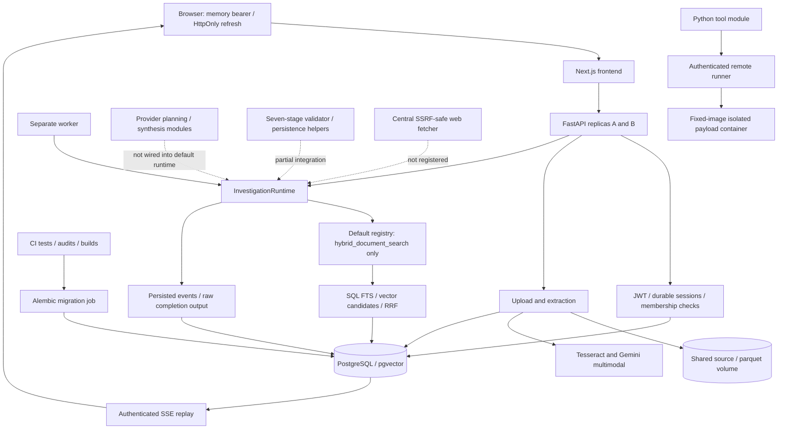

# OmniOps Final Adversarial Audit

## Executive Verdict

**NOT_RELEASE_READY.** Real PostgreSQL, HTTP, worker and browser probes reproduced incorrect agent completion, invalid verified lineage, stale-worker overwrites, missed SSE events, file/database divergence and unbounded unauthenticated metric cardinality. These implementation defects preclude conditional certification. Missing embedding credentials and undeployed cloud infrastructure are not the reason for this verdict.

Audit date: 2026-09-11. Baseline commit: `fae93e75f8a58d4637e9f55f7bd017aad9bf8964`, plus extensive pre-existing working-tree changes. The tested candidate is not reproducible from that commit. Final backend regression: **176 passed, 2 failed, 0 skipped**, pytest time 91.31 seconds; harness elapsed 98.36 seconds.

Application finding counts: **0 demonstrated CRITICAL, 7 HIGH, 11 MEDIUM, 1 LOW**. Container scanner findings are counted separately. Zero demonstrated critical findings does not establish absence.

Phase 7 production code changes: **NONE**. Findings were recorded before repair decisions. The agent, fencing, lineage and transaction corrections require coordinated changes beyond a narrow final-audit fix. Independent small repairs would not certify this candidate and remain explicitly open. Only audit scripts, this document and evidence were added/updated. No unrelated changes were reset, staged or committed. `audit.md` remains untouched, SHA-256 `f52705af7e850c00103a39d29d11c28d91803916fdb22d2cfdf946f23793940c`.

Evidence convention: `E/` below means `phase7-evidence/`. JSON records contain observed results; command JSON contains exit status/duration and corresponding TXT contains output. Authored fixtures are not agent-produced business findings. Prior remediation PASS labels were not accepted as proof.

## Architecture Verified

Inspected production paths include `backend/app/main.py`, `api/deps.py`, `api/v1/{auth,files,investigations,health}.py`, `agent/{service,runtime,persistence,sse_manager,orchestrator}.py`, `worker.py`, `rag/hybrid_search.py`, `evidence/validator.py`, LLM/ingestion/tool modules, models, migrations, frontend types/hooks/report components, all Dockerfiles/Compose variants and all workflows.

Storage is a shared filesystem volume, not an object-storage adapter. PostgreSQL holds sessions, rate buckets, domain state, attempts, leases and events. Docker access belongs to the runner control plane; backend and worker have no socket.

New Phase 7 images ran as two production-configured APIs, worker, runner and frontend with persistent test storage and existing PostgreSQL. The harness launched containers individually, mirroring production settings; this is **not** a claim of executing an exact production Compose cloud deployment. Production Compose configuration validation passed. Browser QA used local HTTPS ingress. The development override and Docker Desktop runner do not certify an independently deployed rootless production runner. Only isolated Phase 7 test resources were faulted.

## Original Audit Reconciliation

Every original registry entry is included. CLOSED applies to that specific finding, not its whole subsystem. “Final regression” refers to `E/final-backend-junit.xml` and `E/final-backend-full.txt`.

| Original Finding | Current Status | Code Evidence | Runtime/Test Evidence | Residual Risk |
| --- | --- | --- | --- | --- |
| SEC-01 fallback secret | CLOSED | `core/config.py` production validation | `E/configuration.json`: missing-secret startup fails | Deployment must supply strong secrets |
| SEC-02 pandas/NumPy sandbox I/O escape | CLOSED | `tools/python_sandbox.py`, runner policy | Fresh security regression; `E/extended-sandbox.json` | Runner host isolation remains external |
| SEC-03 stdout delimiter spoofing | CLOSED | Structured remote result protocol | Fresh adversarial tests and output flood | Original temporary-file IPC description obsolete |
| SEC-04 audio magic bypass | CLOSED | `ingestion/file_guard.py`, `audio_parser.py` | Linux spoof/truncation rejection | Not exhaustive codec fuzzing |
| SEC-05 relative redirect SSRF | CLOSED | `web_fetcher.py` hop validation | Fresh SSRF modules | Controlled resolver tests have stated limits |
| ARC-01 simulated LLM engine | PARTIALLY_CLOSED | Real provider modules; fixed `agent/service.py` plan | Real direct calls in `E/provider-chain.json`; default worker in `E/live.json` | P7-01: provider integration absent |
| ARC-02 tabular re-upload unique error | CLOSED | `api/v1/files.py` dataset upsert | Fresh tabular re-upload regression | Separate file transaction risk P7-06 |
| ARC-03 orphan parquet deletion | PARTIALLY_CLOSED | Unlink before DB commit in files API | Normal deletion test; `E/extended-faults.json` | Transaction failure still causes divergence |
| ARC-04 simulated benchmark runner | CLOSED | `evals/runner.py` real component calls | `E/final-phase1.txt` 15/15, quality NOT_MEASURED | Historical quality percentages invalid |
| ARC-05 web evidence lacks persisted source | STILL_OPEN | No default web source persistence path | Actual registry inspection; no integrated web-domain execution | Web evidence lineage cannot be claimed |
| DAT-01 static audio chunks | CLOSED | Provider timestamp parsing | Live nine-segment audio, `E/provider-chain.json` | Accuracy NOT_MEASURED |
| DAT-02 placeholder image descriptions | CLOSED | Real Gemini vision parser | Live extraction/persistence/retrieval/lineage | Default agent still incomplete |
| DAT-03 disconnected web fetcher | STILL_OPEN | Default registry only retrieval | Actual worker and registry inspection | Fetcher module is not agent integration |
| DAT-04 workspace N+1 | CLOSED | Scalar SQL count subqueries | Fresh workspace aggregation test | No large-directory benchmark |
| DAT-05 DuckDB JSON serialization | CLOSED | `tools/duckdb_tool.py` | Fresh complex-type serialization tests | SQL not registered by default agent |
| DAT-06 membership default typo | CLOSED | `models/user.py` EDITOR default | Inspection and fresh auth regression | Application tenant filters authoritative |
| DAT-07 hardcoded health | PARTIALLY_CLOSED | Real dependency checks in health API | DB-down 503, wrong runner token ready 200 | P7-12 false readiness |
| DAT-08 rigid SQL columns | CLOSED | Generic deterministic SQL in analytical provider | Code and component regression | Not semantic planning |
| FE-01 localhost SSE URL | CLOSED | Configured API base in hook/client | Actual HTTPS browser stream | Ingress config required |
| FE-02 random step IDs | CLOSED | Durable event identity/dedupe | Fresh frontend dedupe/replay checks | Separate server cursor flaw P7-11 |
| FE-03 inconsistent error parsing | CLOSED | API envelope parser | Browser provider error and frontend checks | Completed report contract still fails |
| FE-04 fake wallboard | CLOSED | Current wallboard route behavior | Production scan; no fabricated customer dashboard | No unnecessary route deletion |
| FE-05 non-monochrome UI | OBSOLETE | User-authorized refined dark semantic statuses | Four-viewport screenshots | Strict monochrome superseded |
| FE-06 drawer cannot close | CLOSED | Shared native dialog lifecycle | Escape, focus restoration and interaction tests | No accessibility certification |
| FE-07 fast completion stuck connecting | CLOSED | Replay/polling/terminal handling | Fresh browser and hook terminal checks | Report crash and late commits separately open |
| OPS-01 missing public directory | CLOSED | Frontend assets/Dockerfile | New image build and HTTP 200 | Other release files absent from HEAD |
| OPS-02 missing ESLint | CLOSED | Frontend config/scripts | Fresh lint exit 0 | Static checks do not prove API contract |
| OPS-03 insecure Compose defaults | CLOSED | Production Compose/config fail closed | Production config matrix | Development override differs deliberately |
| OPS-04 generated-file ignore rules | CLOSED | `.gitignore` database/storage rules | `E/hygiene.json` | Extensive untracked release/evidence files |
| OPS-05 cancellation types | CLOSED | `frontend/src/types/api.ts` | Fresh TypeScript/cancellation checks | Full agent integration incomplete |

Registry totals: **24 CLOSED, 3 PARTIALLY_CLOSED, 2 STILL_OPEN, 1 OBSOLETE, 0 NOT_APPLICABLE**.

Additional original narrative items, excluded from the 30-item denominator:

| Original Finding | Current Status | Code Evidence | Runtime/Test Evidence | Residual Risk |
| --- | --- | --- | --- | --- |
| Air-gapped transcription | NOT_APPLICABLE | Explicit unavailable capability | No-key audio unavailable, zero invented segments | Offline neural transcription not implemented/certified |
| Local PostgreSQL unverified | CLOSED | SQL retriever/migrations | Real PG 5/5 and catalog inspection | Semantic quality blocked |
| Automatic provider failure fallback | OBSOLETE | Explicit provider failure; separate deterministic provider | Missing-provider API failure | Default worker bypass remains P7-01 |
| Multi-gigabyte memory footprint | PARTIALLY_CLOSED | Upload/container limits | Linux limit and sandbox pressure probes | Concurrent ingestion limits incomplete; 10 GB NOT_MEASURED |

## Release Blockers

All are OPEN. Mitigations are proposed work, not Phase 7 implementation changes.

| ID | Severity | Impact / exploit or failure scenario | Code and runtime evidence | Mitigation | Blocker |
| --- | --- | --- | --- | --- | --- |
| P7-01 | HIGH | Worker completes one fixed retrieval step with zero evidence/claims; raw report crashes browser on missing `claims.flatMap`. Synthesis events imply work not performed. | `agent/service.py`; `E/live.json`, `E/browser/results.json` | Integrate real planning/tools/domain validation/typed synthesis and verify worker-to-browser flow | YES |
| P7-02 | HIGH | CREATED work not recovered; stale A clears B lease and overwrites B finalized output | `agent/runtime.py`, `persistence.py`; `E/database-probes.json`, `domain-probes.json` | Atomic scheduling and DB-conditional fencing for all mutations, release and finalization | YES |
| P7-03 | HIGH | Nested calculation bypasses source-chain validation; bogus output/hash accepted; deleted evidence leaves VERIFIED claim | `evidence/validator.py`, persistence; `E/boundary-probes.json`, `domain-probes.json` | Central chain validation, truthful calculation verification, dependency invalidation and rejected-row persistence | YES |
| P7-04 | HIGH | Anonymous random 404 paths grow permanent metric labels: 80 requests added 160 series, metrics 904 to 18,564 bytes | `core/observability.py`; `E/live.json` | Fixed unmatched-route label, bounded label dimensions and sustained load regression | YES |
| P7-05 | HIGH | Committed candidate lacks essential production files; clean HEAD launch cannot begin | `E/hygiene.json`, `clean-head-compose.txt` | Deliberately version complete candidate and run clean-checkout gates | YES: artifact integrity |
| P7-06 | HIGH | Failed DB insert leaves written file; failed delete retains DB row but removes file; duplicate content creates untracked physical copy | `api/v1/files.py`; `E/live.json`, `extended-faults.json` | Staged writes, transaction-aware cleanup/deletion, reconciliation and quota reservations | YES |
| P7-11 | HIGH | Later-created event commits first; earlier-created late commit is missed live and on cursor reconnect despite both durable rows | Event persistence/SSE cursor; `E/database-probes.json` | Commit-safe ordering/replay and concurrent transaction regression | YES |

Stale-finalization probe: authoritative owner `new-finalizer`, stored winner `stale`. Deleted-evidence probe: valid-before true, valid-after false, persisted claim VERIFIED. Cursor probe used actual HTTP streaming, not only an in-memory dedupe model.

## Security Assessment

Scoped attacks did not demonstrate auth bypass, foreign content reads, sandbox breakout, private-network SSRF, actual credential leakage or untrusted source HTML execution. Availability and integrity blockers remain decisive.

The production suspicious-pattern inventory has 188 matches reviewed in context (`E/production-claim-scan.json`). UUIDs, bounded retries, explicit unsupported states and authored fixtures are not fabricated business output. Fixed default planning, misleading synthesis/completion and historical quality claims are real concerns. Hallucination, confidence calibration, semantic precision and capacity metrics remain NOT_MEASURED.

Malicious instruction text was retrieved as data without executing tools or overriding network policy. Source content cannot change runner schema/policy. Integrated autonomous LLM prompt-injection resistance is NOT_VERIFIED because the default runtime does not invoke the planner. A nonexecuting retrieved string alone does not prove that stronger property.

## Authentication Assessment

Actual A/B refresh rotation and replay-family revocation passed. Expired, altered, malformed and absent JWTs rejected; old refresh replay returned 401 and invalidated the renewed access session. All-session logout revoked both tested sessions. Browser login/refresh/logout/reload passed. Refresh cookie was HttpOnly, Secure, SameSite=Lax; localStorage/sessionStorage were empty, access token memory-only. Query-token SSE rejected. Bad refresh Origin returned 403; CORS bad preflight 400, allowed 200.

P7-07: correct unpredictable refresh-token ID with wrong secret revoked its session through logout. This is targeted denial, not token forgery. Already-held SSE reauthorization after logout was not independently demonstrated; reconnect authentication was tested. Evidence: `E/live.json`, `final-http.json`, `browser/results.json`; auth/security/session code.

Production image startup failed for missing session secret, missing runner token, missing required database configuration and insecure cookie settings. Test/development startup succeeded (`E/configuration.json`). Capability matrix distinguishes no-key unavailable vision/transcription from configured capabilities; key-presence AVAILABLE is not provider reachability proof. Placeholder configuration fixtures made no requests; real requests are separately recorded.

Actual production-like responses carried request correlation, nosniff and frontend CSP. CSP restricts origins/object/frame/form behavior but allows inline scripts/styles; it is not a strict nonce-based CSP certification. Browser flows worked under it except the demonstrated report-contract crash. No wildcard credentialed CORS was found. TLS/HSTS termination remains external.

## Tenant Isolation

Two-user attacks denied foreign workspace, source, preview, table, investigation, evidence and SSE access. Fresh RBAC/foreign-delete tests passed. Foreign investigation 403 versus unknown 404 leaks existence to a UUID holder (P7-08), so strict no-metadata-leak is not satisfied.

Standalone claim/calculation URLs returning 404 are absent routes, not access-control proof. Raw/artifact/download coverage is limited to supported routes; absent features are NOT_APPLICABLE. Report data comes through investigation responses. Internal lineage joins insufficiently defend against mis-scoped evidence rows, though no public arbitrary evidence writer or foreign-content exploit was demonstrated.

Both lexical and semantic SQL branches apply workspace/source filters before ranking; fresh PostgreSQL tests cover foreign IDs. JSON support links are not composite tenant foreign keys. RLS is absent and pooled transactions do not set tenant identity. This alone does not block release, but application scoping and internal writer correctness remain authoritative. Central scoping helpers/constraints would reduce omission risk.

## Agent Runtime

Real executor code implements registry validation, timeout/budget, retry, cancellation, verification and attempt persistence. Default `InvestigationRuntime` registers only `hybrid_document_search`, constructs fixed `retrieval-1`, and treats nonempty retrieval results as completed work. No provider planning, replanning, semantic reflection, SQL/Python/web execution or report synthesis is integrated there. Request max_steps is not the intended persisted execution budget.

API execution checks key presence; worker bypasses that guard. Synthesis states/events are not evidence of actual synthesis. Injected-registry tests pass but do not prove the default production agent. Compatibility orchestrator routes through runtime; no inspected compatibility path bypassed runner restrictions. Real provider planning/synthesis were tested directly, outside this runtime.

## Evidence Integrity

Seven model stages and UUID/provenance helpers exist. Nullable legacy links and JSON evidence/calculation/support arrays do not enforce every edge as a DB foreign key. Direct validation rejects nonexistent/empty/wrong-workspace/wrong-investigation references, source-chain mismatch and quote mismatch.

Nested calculation evidence omits source-chain comparison: a source-A chunk linked to source-B evidence failed direct validation but passed through a calculation. Formula `10+1`, output `999`, hash `not-a-valid-hash` passed presence-only validation. Deleting source evidence left its claim VERIFIED with dangling citations.

Validator does not take the claim statement for entailment: unrelated/conflicting assertions cannot become semantically proven by reference resolution. Empty inference support validator returns valid; empty recommendation support rejects. Invalid proposed claims are skipped rather than persisted as rejected records. UI wording “references verified” is appropriately qualified, but stale VERIFIED rows still fail integrity. Full production seven-stage investigation flow FAILS despite direct-module fixtures.

## Retrieval

Production uses pgvector, PostgreSQL FTS, DB-side top-K candidates, workspace/source restrictions and RRF; no production full-corpus Python ranking. Lexical-only mode is explicit without embeddings. Genuine OCR/transcript chunks were retrieved lexically and linked to evidence.

Catalog inspection verified HNSW, GIN and workspace indexes. On 6,000 authored synthetic rows, production semantic query shape used sequential scan/sort/window while simple distance-order control used HNSW. FTS chose sequential scan too. Index existence is proven, production acceleration is not. Fixture statistics/pending index state and planner costs limit generalization (P7-14).

Final retrieval integration: 5 passed. Recall@K, Precision@K, MRR, nDCG: **NOT_MEASURED / BLOCKED BY CREDENTIAL**. No compatible embedding key was available; provider was not changed to clear this gate. Synthetic vectors are SQL behavior fixtures, not semantic quality results.

## Multimodal

Six minimal real Gemini requests covered image, silent audio, authored speech, planning and synthesis. Image yielded genuine content with provider/model/request provenance. Silence yielded NO_TEXT_DETECTED. Authored TTS speech yielded nine segments, timestamps 100–4200 ms and provider label `spk:0`. Image/audio chunks were persisted to temporary PostgreSQL, retrieved lexically and validated through evidence lineage (`E/provider-chain.json`). This direct-module chain is not an HTTP-upload-to-autonomous-report pass.

Direct planning returned one structured task and synthesis one structured claim; default runtime integration remains absent. Multimodal provenance persisted; text-provider request provenance in actual investigation persistence is unproven. Speaker labels prove parsing, not multi-speaker accuracy. Vision/transcription/timestamp/diarization accuracy: NOT_MEASURED.

Linux probes: native PDF 1 chunk; scanned 1 OCR; mixed 2 native/OCR; empty NO_TEXT; image-heavy 3 OCR; malformed/501-page rejected. Windows without OCR returned truthful partial states. PNG/JPEG dimensions real, malformed/spoof rejected; 20,000,000 pixels accepted by gate and larger boundary rejected. OCR image yielded real text with unavailable semantic provider. Valid no-key audio UNAVAILABLE; spoof/truncation/excess declared duration rejected.

Linux 50 MB + 1 byte upload returned 413. Windows hit open-file cleanup PermissionError (P7-18). Traversal sanitized; archives/macros/OOXML traversal rejected. Full four-hour audio, every codec, exact maximum archive expansion and extreme PDF rendering geometry were not exhaustively allocated/fuzzed. Malware scanning remains DEPLOYMENT_CONTROL. Evidence: `E/media.json`, `linux-media-results.json`, provider artifacts.

## Sandbox

Fresh authenticated remote attacks exercised environment secrets, forbidden files/mounts, network, subprocess/process pressure, CPU loop, memory, output flood and privilege indicators. Safe output succeeded; payload UID 65532, CapEff zero, NoNewPrivs 1. Host/backend env and socket absent; root writes/network failed. Abuse failed or bounded, with some generic infrastructure_failure classifications. Output capped 65,536 bytes; no leftover payload job observed.

Missing auth 401; privileged override field 422. Fixed request schema exposes no arbitrary image/mount/network/environment injection. Backend/worker have no Docker socket. Runner remains root as Docker control plane, distinct from non-root payload. No independent rootless runner-host/kernel certification. Evidence: `E/extended-sandbox.json`, fresh security tests and image inspections. No host attack outside controlled sandbox.

## SSRF / Web Security

Central fetcher rejects credential URLs/nonpublic addresses, pins resolution, checks redirect hops, and bounds size/time/redirects. Fresh policy tests cover loopback/localhost/metadata/RFC1918/IPv6 private/numeric notation, redirects, DNS changes, response limits, compression and timeout behavior. Existing SSRF/adversarial modules passed.

Several edge cases use controlled resolvers/transports invoking production policy. A public hostile rebinding service and every live slow/compression server were NOT_RUN end to end. No uncontrolled metadata endpoint was attacked. Fetcher tests do not close missing default-agent web registration/persistence.

## Persistence / Durability

Five concurrent PostgreSQL writers for each evidence/calculation/claim/event identity yielded one unique ID, zero errors (`E/domain-probes.json`). Existing PostgreSQL tool-attempt crash/idempotency tests passed. This does not establish exactly-once provider side effects or finalization.

Real worker killed during scoped DB-trigger delay after tool completion rolled back attempt persistence; restart recovered and failed EVIDENCE_NOT_FOUND without invented evidence. Nine durable events, zero duplicate domain rows. Separate stale release/finalization and CREATED scheduling probes failed P7-02.

Scoped DB failures after file write left one file/zero rows; failed source delete left row/file missing. Duplicate content with a new name created two files/one source. No demonstrated reconciliation job. Shared volume persists ordinary container restart, not transaction correctness, replication or coordinated restore.

## SSE / Multi-Worker

Normal 40-event A/B replay, 20-event cursor suffix, A SIGKILL/restart with B serving, and post-restart exact history passed. Missing/invalid/expired/query bearer rejected; refreshed reconnect succeeded. Frontend dedupe/replay passed.

Two legitimate writer transactions committing out of creation order lost the late commit from live and Last-Event-ID replay (P7-11). Full no-cursor history can recover it; current cursor progression cannot. Twenty held streams did not exhaust pool. Slow client received all 1,200 large events in order with zero duplicates; local subscriber queue cap 100/detachment tested. These passes do not close cursor loss.

## Database / Migrations

Temporary empty PostgreSQL upgraded to `20260911_phase6_sessions`; latest downgrade/re-upgrade/head and final upgrade passed. Vector/index catalogs inspected. Production uses migrations; create_all is SQLite-only and production rejects SQLite.

Custom-format temporary DB backup restored into separate temporary DB, marker matched head. Coordinated source-volume backup/restore NOT_RUN. OPERATIONS backup commands need libpq-compatible URL, not SQLAlchemy `postgresql+asyncpg` URL. Short connection snapshots showed no idle transactions and pool recovery, not exhaustive leak absence. Refresh concurrency passed; file/fencing consistency failed.

## Frontend

Fresh TypeScript, lint, production build, npm audit, seven interaction tests and both stream probes passed. Actual worker-completed report crashed on missing claims: compile-time types did not validate backend JSON.

Browser evidence: 48 screenshots at 1440x900, 1280x800, 768x1024, 390x844 across auth/dashboard/sources/investigation/trace/dialogs/provider-error/not-found/authored report and actual broken report. No horizontal overflow in captures. Authored report explicitly labelled; no fabricated agent achievement. Malicious filename/source/report strings remained escaped with no script/image-handler execution or alert.

Keyboard focus, ten-Tab dialog containment, Escape retaining native modal through exit, restoration, ordinary reopening and reduced-motion immediate closure checked. Rapid reopen during a pending exit was not freshly stress-tested in Phase 7. CSS 200% zoom no overflow; actual browser 200% zoom/formal contrast/assistive-technology certification NOT_RUN. Not WCAG certification. Mobile New Investigation measured 42x44 px (P7-19). Frontend remained frozen; no design changes.

## Dependency / Container Security

Fresh pip-audit requirements: no known vulnerabilities. Active backend image virtualenv freeze audit: none. npm audit: zero. These do not cover every base/OS package.

| Final Phase 7 image | Critical | High | Medium | Low |
| --- | ---: | ---: | ---: | ---: |
| backend | 0 | 12 | 16 | 80 |
| python-sandbox | 0 | 12 | 16 | 80 |
| sandbox-runner | 0 | 12 | 16 | 80 |
| frontend | 0 | 0 | 0 | 0 |

Fresh Docker Scout evidence: `E/scout-*.txt`, `E/results-summary.json`. Counts are entries: msgpack CVE/GHSA alias duplicate means 12 highs represent 11 underlying IDs per affected image. Old Phase 6 counts are not current.

| High entries | Review / disposition |
| --- | --- |
| CVE-2026-57585 / GHSA-6v7p-g79w-8964, msgpack 1.1.2 | Same issue twice, Unpacker reuse after caught error. No app Unpacker path identified; absent active venv, exact base/vendored location unresolved. Retain finding. [Upstream](https://github.com/msgpack/msgpack-python/security/advisories/GHSA-6v7p-g79w-8964). |
| CVE-2025-47273, setuptools 70.3.0 | PackageIndex download traversal; no runtime installer endpoint, absent active venv. Build/base exposure requires remediation. [Upstream](https://github.com/pypa/setuptools/security/advisories/GHSA-5rjg-fvgr-3xxf). |
| CVE-2026-88047, 88048, 88049, Tesseract 5.5.0-1 | Crafted traineddata/model structures; image uploads do not select arbitrary models. Keep model supply-chain risk. [Debian 88047](https://security-tracker.debian.org/tracker/CVE-2026-88047), [88048](https://security-tracker.debian.org/tracker/CVE-2026-88048), [88049](https://security-tracker.debian.org/tracker/CVE-2026-88049). |
| CVE-2026-88051, 88052, 88053, Tesseract | Scanner findings retained; repeated primary fetches unavailable. Reachability UNRESOLVED, not declared harmless/patched. |
| CVE-2026-74860, libxml2 | Python SAX/DTD path; matching binding absent active venv, no demonstrated app exploit. [Debian](https://security-tracker.debian.org/tracker/CVE-2026-74860). |
| CVE-2026-86140, libxml2 | Validation formatting path, application reachability unproven; retain. [Debian](https://security-tracker.debian.org/tracker/CVE-2026-86140). |
| CVE-2026-85091, zlib | Nonblocking gzip write path, no app call identified; version/applicability uncertainty retained. [Debian](https://security-tracker.debian.org/tracker/CVE-2026-85091). |

P7-16 application risk is MEDIUM for unresolved exposure, not a downgrade of scanner HIGH. No exploitable critical dependency demonstrated. Backend/frontend UID/GID 10001, payload 65532, runner root control plane. Backend/worker no socket; payload capability/no-new-privilege restrictions stronger than explicit app container restrictions.

## CI/CD

Inspected CI paths/dependencies, pgvector service, migrations/tests, frontend build, dependency audit and image commands. Local components ran; two fresh failures prevent green regression. “Live-provider” workflow exercises monkeypatched provider contracts; its name does not prove hosted live calls.

Manual release builds/pushes backend/frontend SHA tags only. No required successful CI/audit dependency, runner/sandbox publication, migration/deploy/readiness/smoke execution. Version input unused; SHA tag is not immutable digest enforcement. Actions use version tags rather than commit pins. No fork-secret abuse demonstrated; no push/external messages sent. P7-15 remains.

**GitHub-hosted CI: NOT_RUN.** Remote exists, gh unavailable, no hosted result independently verified. Clean HEAD misses required release files. Local builds are not hosted CI execution.

## Observability

Request correlation headers, structured logs and per-process Prometheus request/latency-sum/SSE metrics observed. Not shared aggregation/histogram deployment. Unmatched-path labels unbounded (P7-04). Error-envelope request ID can remain null despite response header.

Complete stdout+stderr scan: 449,870 bytes, no exact known credentials/passwords or JWT/refresh literals. SQL error text present internally. Logs not exported with secret-bearing environment values. Controlled provider exception sentinel logged verbatim by `llm/client.py` (P7-09): actual key leakage not observed, but redaction boundary unsafe.

Refresh replay security event observed. Dedicated login/logout/rotation/member/source-deletion audit-event coverage incomplete; cancellation has durable runtime events (P7-17). Generic access logs are not equivalent to all requested security events.

## Failure Testing

| Failure | Actual result | Evidence / limitation |
| --- | --- | --- |
| DB down | Liveness 200 / readiness 503 | `E/last-ops.json`, isolated bad DB config |
| Runner down | Unavailable readiness, execution fail closed | Extended topology/sandbox probes |
| Wrong runner token | Execution 401, readiness incorrectly 200 | P7-12 |
| Gemini unavailable | Explicit unavailable extraction/API failure | Worker bypass P7-01 remains |
| SSE disconnect | Normal replay works | Late commit P7-11 fails |
| Backend A dies | B continues, restarted A exact normal history | `E/extended-faults.json` |
| Worker dies | Rollback/restart explicit failure | Scoped trigger and SIGKILL |
| Stale worker | Clears new lease / overwrites final output | FAIL P7-02 |
| Invalid evidence | Direct rejects; nested/deletion fail | P7-03 |
| Rate exceeded | Shared A/B 429 | `E/final-http.json` |
| Expired access | API/SSE 401 | Final HTTP probes |
| Refresh replay | Family revoked | Live A/B requests |
| File/DB fault | Orphan or missing retained file | FAIL P7-06 |

Initial network-disconnect readiness harness interrupted HTTP reachability; not valid readiness proof. Networking restored; isolated bad-DB image probe supersedes it. Failed harness attempts are not counted as passes.

Fresh final command results (ops scripts record exact commands/output):

| Gate | Result | Evidence |
| --- | --- | --- |
| `python -m evals.runner` Phase 1 | 15/15, quality NOT_MEASURED | `final-phase1.txt` |
| Phase 3 PostgreSQL modules | 27 passed | `final-backend-junit.xml` |
| Phase 4 plus sandbox/SSRF/adversarial modules | 71 passed; separate DuckDB tests also pass | Same JUnit |
| Phase 5 modules | 25 passed, 2 failed | Same JUnit |
| Phase 6 modules | 13 passed | Same JUnit |
| Entire backend with PostgreSQL enabled | 176 passed, 2 failed, 0 skipped | `final-backend-full.txt` |
| PostgreSQL retrieval | 5 passed | `final-postgres-retrieval.txt` |
| PG runtime concurrency | Existing suite passes; new invariants fail | JUnit plus database/domain probes |
| TypeScript/lint/build | All exit 0 | `final-frontend-*.txt` |
| Frontend interaction/dedupe/replay | Seven interaction tests plus both probes pass | Same artifact family |
| npm/pip requirements/active image audit | Zero reported known vulnerabilities | Audit artifacts |
| Empty migration/down/up/final head | Pass | Migration artifacts |
| Four images / production-like smoke | Builds pass; final A/B ready 200 | Build artifacts, last-ops |

Failing tests: `test_audio_segments_preserve_provider_timestamps_and_null_speakers`, `test_audio_provider_empty_result_is_no_text_not_fabricated`. They fake provider construction but leave the key guard active, returning TRANSCRIPTION_UNAVAILABLE in credential-free execution. This is a non-hermetic fixture defect; live speech success does not make regression green.

Incomplete requested gates: semantic evaluation credential-blocked; hosted CI/cloud/rootless-runner deployment; full clean-checkout dependencies/build/launch after missing-file failure; coordinated source restore; long-duration growth/capacity; exhaustive media/archive fuzzing; complete live DNS-rebinding/slow-server infrastructure; true browser zoom/contrast certification; integrated autonomous prompt-injection/claim synthesis. These are NOT_RUN/NOT_MEASURED, not inferred PASS.

## Performance Sanity

Twenty held SSE clients plus 100 authenticated API reads, concurrency ten: 100 HTTP 200, p50 83.79 ms, p95 495.66 ms. PostgreSQL snapshot one active/11 idle/no idle transaction. Local observation only, no SLA/capacity claim.

Twenty-four investigation submissions concurrency four across A/B: 20 HTTP 200/four 429. Thirty-two invalid uploads: 30 HTTP 400/two 429. Fourteen bad logins: six 401/eight 429; earlier logins had already consumed shared bucket, so not an empty-bucket threshold measurement.

Slow client: 1,200 approximately 8 KiB events, exact order/zero duplicates. RSS KiB before 240,092, paused 250,152, after 250,164: about 10 MiB retained at snapshot. Allocator versus leak NOT_DETERMINED at this duration. PG one active/three idle/no idle transaction. No orphan payload jobs observed. Actual source orphans, stale leases and metrics growth mean overall resource-growth clearance FAILS.

## Repository Hygiene

Targeted credential scan: 425 nonignored working files, 141 historical blobs/three commits; no private-key/Google/OpenAI/GitHub/AWS signatures. No nonignored file over 10 MB at snapshot. Dedicated gitleaks/trufflehog unavailable. This is limited pattern/history inspection, not exhaustive entropy/validity scanning. Local env values not printed/committed.

`E/hygiene.json` records dirty/untracked files. Essential untracked production Compose, observability, worker, latest migration and CI absent from HEAD. Safe git-archive copy under ignored `.ui-qa/phase7-clean-head` failed actual Compose config due to missing file; subsequent clean-checkout gates blocked, not simulated with working-tree dependencies. Host tests and ignored local Playwright further limit reproducibility. Fresh Linux Docker builds installed dependencies through Dockerfiles.

No broad cleanup/reset/staging/commit. Prior evidence preserved. Phase 7 additions: this document, `scripts/phase7_*.py`, `scripts/phase7_browser.cjs`, `phase7-evidence/` JSON/logs/screenshots/authored media/temporary test backup. Existing UI/Phase 6 scripts remain unchanged by Phase 7.

## Documentation Accuracy

README, OPERATIONS and all remediation/audit reports were claims to verify. Qualified SQL hybrid retrieval, OCR/Gemini, memory-only access, remote sandbox and durable event storage have scoped proof. Full autonomous agent, complete lineage enforcement, exactly-once recovery, production-ready and zero-hallucination claims are contradicted or unsupported.

Historical 99.07% precision/0% hallucination are not measurements endorsed here. Index presence is not measured acceleration; speaker parsing is not accuracy. Shared files are not object storage or transaction-safe persistence. Retention is manual policy/deletion, not automated retention. Audit/release/live-provider workflow descriptions must not imply missing behavior. Backup commands require libpq-compatible URLs. Original audit has no numeric category before-scores, so NOT_SCORED is used below.

## Residual Risks

Seven HIGH findings are fully registered above. Additional risks:

| ID / group | Severity | Impact, scenario and evidence | Mitigation | Release blocker |
| --- | --- | --- | --- | --- |
| P7-07 logout token-ID trust | MEDIUM | Correct random ID/wrong secret revokes session; live probe | Verify hash before token-directed revocation | No independent blocker |
| P7-08 existence oracle | MEDIUM | Foreign 403 versus unknown 404 | Consistent authorized lookup/error semantics | No content disclosure demonstrated |
| P7-09 raw exception logs | MEDIUM | Sentinel logged verbatim; known-secret scan clean | Safe structured codes/redaction | No actual secret disclosure demonstrated |
| P7-10 non-hermetic tests | MEDIUM | Two tests depend on real key guard | Explicit fake capability config, credential-free regression | YES: regression gate |
| P7-12 false runner readiness | MEDIUM | Wrong token ready 200, execution 401 | Authenticated executable readiness check | Deployment risk; no auth bypass |
| P7-13 provider/resource quotas | MEDIUM | Broad user spend/concurrency caps absent, unused settings and workspace quota races | Shared reservations/budgets/bounded ingestion | No critical billing loop demonstrated |
| P7-14 index-use uncertainty | MEDIUM | Production query scans 6,000 vectors, control HNSW works | Production-shaped plans/query tuning | No performance claim allowed |
| P7-15 release gates | MEDIUM | Publication lacks test/audit gating and complete image/deploy chain | Gate publish, complete image set, explicit deployment handoff | YES: pipeline gate |
| P7-16 package exposure | MEDIUM | 12 scanner HIGH entries/image, three advisory reviews unresolved | Patch/remove and assess exact reachable versions | Unresolved certification condition, not called exploitable critical |
| P7-17 audit trail gaps | MEDIUM | Dedicated login/logout/member/source events incomplete | Redacted security events/tests | No independent blocker |
| P7-18 Windows cleanup | MEDIUM | Oversize temp-file open-handle PermissionError; Linux 413 pass | Close before cleanup; cross-platform test | No Linux production blocker |
| P7-19 mobile target | LOW | New Investigation 42x44 px | Minimum 44 px height | No |
| Application-only isolation | OPERATIONAL | No RLS/composite tenant links; internal chain weakness | Central scoping/constraints, deliberate RLS design | Not automatically; P7-03 already blocks |
| External runner/TLS/cloud | OPERATIONAL | Rootless host/ingress/cloud not live-certified | Deploy and exercise controls | External condition |
| Backup/retention | OPERATIONAL | DB restore tested, coordinated file restore absent, manual retention | Volume backup/reconciliation/recovery drills | P7-06 already blocks |
| Optional semantics/quality | KNOWN LIMITATION | No compatible embedding key; quality NOT_MEASURED | Credentials and labelled corpus evaluation | Not independently core safety blocker |
| Malware/long-duration QA | KNOWN LIMITATION | No scanner/full fuzz/growth certification | Deployment controls and targeted tests | No invented certification |

Medium/low issues were not silently repaired. Accepting external limitations cannot excuse demonstrated implementation defects.

## CV-Safe Claims

- Built FastAPI/Next.js platform components with PostgreSQL sessions, refresh rotation and application workspace isolation.
- Implemented filtered PostgreSQL FTS/pgvector candidate retrieval and RRF; semantic quality evaluation remains pending.
- Implemented event persistence, tool-attempt identities and worker leases; adversarial audit found remaining fencing/replay defects.
- Modelled seven-stage provenance and validation helpers; full enforcement and production agent integration remain incomplete.
- Integrated genuine Gemini image/transcription and Tesseract OCR with provenance and lexical retrieval of persisted extractions.
- Implemented authenticated fixed-image sandbox execution with non-root, network-restricted payloads and resource controls.
- Built container/migration/configuration/interaction checks and CI definitions; hosted release certification remains incomplete.

Reject claims of production-ready autonomous agents, zero hallucination, accuracy percentages, fully verified calculations, complete exactly-once recovery, enterprise-grade security, certified tenant isolation, measured HNSW gains, accurate diarization percentages or deployed end-to-end CI/CD. Scope component claims explicitly.

## Final Scorecard

Scores are reviewer judgments, not measured percentages. Original report supplied no numeric category scores.

| Category | Original | Final / 10 | Evidence |
| --- | --- | ---: | --- |
| Security | NOT_SCORED | 5 | Scoped auth/sandbox/SSRF pass; public metrics DoS/log/package gaps |
| Agent Architecture | NOT_SCORED | 3 | Executor exists; default fixed retrieval bypasses intended agent |
| Evidence Integrity | NOT_SCORED | 3 | Provenance structures, failed chain/deletion/calculation semantics |
| Retrieval | NOT_SCORED | 6 | Real SQL filtering/RRF, quality blocked/index uncertainty |
| Multimodal | NOT_SCORED | 7 | Real image/speech/OCR chain, quality unmeasured/tests red |
| Runtime Durability | NOT_SCORED | 3 | Normal identity/replay pass, stale ownership/late commits fail |
| Tenant Isolation | NOT_SCORED | 6 | Public denial, existence oracle/internal chain weakness |
| Auth/Session | NOT_SCORED | 7 | Live rotation/replay/cookies pass; logout/audit gaps |
| Frontend | NOT_SCORED | 5 | Responsive escaped rendering, actual report crash |
| Deployment | NOT_SCORED | 5 | Images/topology work, clean HEAD incomplete/external controls |
| Observability | NOT_SCORED | 4 | Metrics/logs exist, cardinality DoS/false readiness |
| Testing | NOT_SCORED | 5 | Real adversarial evidence, two failures/integration gaps |
| CI/CD | NOT_SCORED | 3 | Local components work, hosted NOT_RUN/publication gates absent |
| Documentation | NOT_SCORED | 4 | Useful qualifications, prior full-verification claims contradicted |

## Final Classification

**NOT_RELEASE_READY.** Core integrity/durability defects, actual browser report failure, red regression and incomplete committed release artifact remain. Conditional certification would conceal implementation flaws. This concludes Phase 7 with an adverse verdict; no further phase is created.
