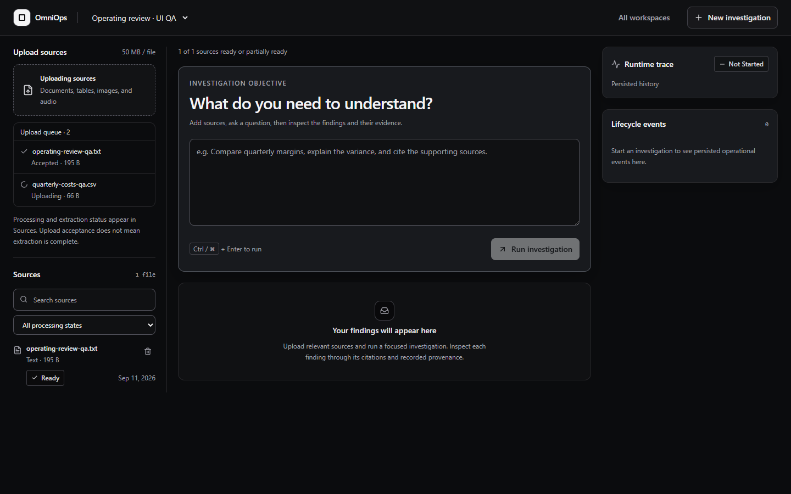

# OmniOps

<p align="center">
  <strong>Autonomous Business Investigations with Inspectable Evidence & Durable Agent Execution</strong>
</p>

<p align="center">
  
  
  
  
  
  
  
  
</p>

---

## 🌟 About OmniOps

OmniOps is an enterprise-grade AI investigation platform engineered for operational and financial analysis. Unlike conventional AI chat tools that can hallucinate unverified numbers, OmniOps is built on an **evidence-first architecture**: every claim is linked to verbatim source citations, and every numerical calculation is verified through deterministic sandboxed execution with canonical cryptographic hashing.

### Key Highlights
- 🔍 **Hybrid Vector & Lexical Retrieval:** Combines pgvector cosine similarity with PostgreSQL Full-Text Search (FTS) through Reciprocal Rank Fusion (RRF with $k=60$).
- 🛡️ **Seven-Stage Evidence Provenance:** Enforces unbroken lineage from `VerifiedClaim` &rarr; `EvidenceItem` &rarr; `DocumentChunk` &rarr; `SourceDocument`, with automated cascading invalidation if sources are modified or removed.
- ⚡ **Durable Agent Runtime & Lease Fencing:** State-machine execution backed by PostgreSQL row leases preventing split-brain worker overwrites, with monotonic Server-Sent Events (SSE) sequencing for lossless streaming.
- 🔒 **Defense-in-Depth Sandboxing:** Non-root Python code execution with zero network access (`--net=none`), disposable tmpfs filesystems, and strict memory/CPU/process bounds.
- 📑 **Multimodal Ingestion Pipeline:** High-fidelity ingestion of PDFs, spreadsheets, audio recordings, and images using PyMuPDF, DuckDB, Tesseract OCR, and Gemini multimodal models.

The platform architecture, verification results, and design constraints are detailed in the authoritative [FINAL_AUDIT.md](FINAL_AUDIT.md).

[Engineering Walkthrough](docs/ENGINEERING.md) · [Local Setup](#run-locally) · [Verification](#verification) · [Operations](OPERATIONS.md) · [Final Audit](FINAL_AUDIT.md)



---

## Core Capabilities

| Capability | Implementation | Key Invariants |
|---|---|---|
| **Hybrid Retrieval** | PostgreSQL 16 + pgvector cosine similarity and Full-Text Search (FTS) fused via Reciprocal Rank Fusion (RRF with $k=60$). | Database-level SQL predicates enforce strict workspace tenant isolation; HNSW and GIN index utilization verified in query plans. |
| **Multimodal Ingestion** | Native PDF text extraction (PyMuPDF), Tesseract OCR for scanned pages, Gemini Interactions API for semantic image vision and audio transcription. | Modality provenance and verbatim chunk offsets preserved; unavailable providers report explicit status without synthetic fallback. |
| **Evidence Lineage** | Seven-stage verification linking `VerifiedClaim` -> `EvidenceItem` -> `DocumentChunk` -> `SourceDocument`. | Broken lineage, cross-workspace references, or ungrounded proposals are rejected; source deletion cascades to mark claims `REJECTED` (`SOURCE_DELETED`). |
| **Calculation Integrity** | Python math and DuckDB analytical queries executed in isolated sandboxes. | Canonical sort-keyed JSON hashing (`calculation_reproducibility_hash`) guarantees identical reproducible calculation identities locally and remotely. |
| **Durable Agent Runtime** | State-machine runtime with heartbeated worker leases, atomic database scheduling, and crash recovery. | Lease fencing prevents stale workers from corrupting synthesis reports or mutating execution attempts. |
| **Commit-Safe SSE** | Real-time Server-Sent Events with monotonic delivery sequencing (`delivery_sequence`). | Prevents event loss or skips across out-of-order transaction commits; supports clean client reconnection and cursor replay. |
| **Sandbox Isolation** | Authenticated runner spawning ephemeral containerized Python runners. | Non-root UID 65532, read-only root filesystems, disposable tmpfs, `--net=none` network isolation, and CPU/memory/process caps. |
| **Session Security** | Database-backed sessions, memory-only JWT access tokens, HttpOnly refresh cookies with SHA-256 rotation and replay family revocation. | Logout validates refresh-cookie secret against database session before revocation; SSRF policy strictly validates IP ranges on every redirect hop. |

---

## Architecture

```text
Next.js (App Router / TypeScript / Tailwind)
      ↓ Authenticated REST / Bearer-header SSE
FastAPI API Replicas (Port 8000 / Non-root)
      ↓ SQL Queries & Predicates
PostgreSQL 16 + pgvector (Sessions, Leases, Vector/FTS Chunks, Events)
      ↓ Leased Execution & Task Claiming
Durable Agent Runtime (Worker / State Machine / Lease Fencing)
      ↓ Tool Invocation
Tool Registry (Hybrid Document Search, DuckDB, Python Sandbox)
      ↓ Lineage Validation & Canonical Hash
Evidence Verification (Seven-stage provenance & cascade invalidation)
      ↓ Modality Handlers
Gemini / Multimodal (Image vision, transcription, Tesseract OCR)
      ↓ Bearer-authenticated /v1/execute
Sandbox Runner (Ephemeral non-root container, --net=none, resource limits)
```

**Tech Stack:** Python 3.12, FastAPI, async SQLAlchemy, Alembic, PostgreSQL 16 / pgvector, DuckDB, PyArrow, Pydantic v2, PyMuPDF, pytesseract, Next.js 15, React 19, TypeScript, Tailwind CSS, Docker, and Caddy.

---

## Run Locally

### Prerequisites
- Python 3.12+
- Node.js 20+
- Docker & Docker Compose (optional for local SQLite, required for full PostgreSQL/pgvector and sandbox execution)
- Ollama for free local planning and synthesis, or credentials for an explicitly selected hosted provider

### Local planning and synthesis with Ollama

This machine profile (16 GB RAM and a 6 GB RTX 4050 Laptop GPU) is well suited to
`qwen3:4b` (about 2.5 GB quantized) as the default. `qwen3:1.7b` is the
lower-resource alternative; `qwen3:8b` may improve quality but is more likely to
spill beyond 6 GB VRAM and run more slowly.

1. Install [Ollama](https://ollama.com/download) and keep its local service running.
2. Pull one model: `ollama pull qwen3:4b`.
3. Set `LLM_PROVIDER=ollama`, `OLLAMA_MODEL=qwen3:4b`, and set
   `OLLAMA_BASE_URL=http://host.docker.internal:11434` for Docker Desktop. Use
   `http://127.0.0.1:11434` when the backend and worker run directly on the host.
4. Start OmniOps and request `/api/v1/readiness`; `checks.llm_provider.status`
   must be `ready` before running an investigation.
5. Upload a source, wait for `READY`, then create an investigation normally.

Provider selection is explicit and never falls back after failure. Ollama handles
text planning, tool decisions, and synthesis only. Tesseract OCR remains local;
Gemini credentials and compatible Gemini models are still required for the
existing image-vision and audio-transcription capabilities. Local generative
models are not used as embedding models, so PostgreSQL lexical retrieval remains
available when semantic embeddings are unavailable.

### 1. Backend Setup

```bash
git clone https://github.com/sohaib-0897/OmniOps.git
cd OmniOps/backend
python -m venv .venv
```

Activate the environment:
- **Linux/macOS:** `source .venv/bin/activate`
- **Windows (PowerShell):** `.venv\Scripts\Activate.ps1`

Install dependencies and run the API:

```bash
python -m pip install -r requirements.txt
python -m uvicorn app.main:app --reload --port 8000
```

By default, the backend operates in development mode. To run against PostgreSQL with pgvector, set `DATABASE_URL` and run migrations:

```bash
alembic -c alembic.ini upgrade head
```

### 2. Frontend Setup

In a separate terminal:

```bash
cd OmniOps/frontend
npm ci
npm run dev
```

Open [http://localhost:3000](http://localhost:3000) to access the workspace interface. Interactive API documentation is available at [http://localhost:8000/docs](http://localhost:8000/docs).

### 3. Docker Compose (Full Local Topology)

To run the complete production-like stack locally:

```bash
docker compose --env-file .env.example -f docker-compose.yml up --build
```

---

## Verification & Test Results

The platform enforces zero unexplained skips, zero failures, and comprehensive regression coverage across all core systems:

| Verification Suite | Target / Command | Result |
|---|---|---|
| **Full Backend Suite** | `pytest backend/tests -q --disable-warnings` | **212 passed, 0 failed, 0 skipped** (95.81s) |
| **Benchmark Evals** | `python -m evals.runner` | **15 / 15 passed (100%)** |
| **PostgreSQL Retrieval** | `pytest backend/tests/test_postgres_hybrid_retrieval.py` | **6 passed** (FTS, vector distance, RRF, HNSW/GIN plans) |
| **Phase 1 Integrity** | `pytest backend/tests/test_phase1_integrity.py` | **7 passed** |
| **Phase 3 Runtime** | `pytest backend/tests/test_phase3_*.py` | **27 passed** (leases, recovery, fencing, idempotency) |
| **Phase 4 Security** | `pytest backend/tests/test_phase4_*.py ...` | **74 passed** (runner boundary, SSRF, sandbox container) |
| **Phase 5 Multimodal** | `pytest backend/tests/test_phase5_*.py` | **27 passed** (20 multimodal hermetic, 7 provider contract) |
| **Phase 6 Platform** | `pytest backend/tests/test_phase6_platform.py` | **16 passed** (auth rotation, cookies, SSE backpressure) |
| **Final Closure Tests** | `pytest backend/tests/test_final_audit_closure.py` | **5 passed** (provider planning, canonical hashes, cascade) |
| **Frontend TypeScript** | `npx tsc --noEmit` (in `frontend/`) | **Exit code 0 (0 errors)** |
| **Frontend Linter** | `npm run lint` (in `frontend/`) | **Exit code 0 (0 warnings, 0 errors)** |
| **Frontend Production Build** | `npm run build` (in `frontend/`) | **Exit code 0 (Next.js optimized build)** |
| **Frontend Unit Tests** | `node --test scripts/ui_frontend_tests.cjs` | **8 passed, 0 failed** |
| **Python Security Audit** | `pip-audit -r backend/requirements.txt` | **0 known vulnerabilities** |
| **Node Security Audit** | `npm audit` (in `frontend/`) | **0 vulnerabilities** |
| **SSE Replay Probe** | `python scripts/final_sse_probe.py` | **PASSED** (ordering, late commits, A/B persistence) |

---

## Production Topology & Security

- **Container Boundaries:** API replicas A and B, background worker, and frontend containers run as non-root (UID 10001), have read-only root filesystems with temporary tmpfs mounts, and carry **no Docker socket**.
- **Runner Boundary:** The sandbox runner operates on a separate port (9100) requiring bearer token authentication. Container executions run under UID 65532 with `--net=none` and strict CPU/memory/process limits.
- **Migration Head:** Database schema version is tracked under Alembic head `20260912_final_audit_closure` with reversible upgrade/downgrade paths.
- **Observability:** Bounded Prometheus metric labels prevent path-based cardinality attacks by grouping unmapped routes under `route="__unmatched__"`.

---

## Known External Limitations

As documented in [FINAL_AUDIT.md](FINAL_AUDIT.md), the following operational prerequisites apply to production deployment:
1. **Dedicated Rootless Runner Host:** In cloud production, the sandbox runner service requires hosting on an external, rootless container engine with network isolation rather than sharing the local daemon.
2. **Hosted CI Execution:** Workflows are verified locally; remote execution depends on triggering the configured GitHub Actions runners.
3. **Semantic Embedding Quality Evaluation:** Vector search logic and RRF fusion are verified on PostgreSQL; benchmark quality measurement of live embedding generation requires supplying a compatible third-party embedding credential.
4. **Cloud Deployment:** Local multi-container topologies and readiness gates were verified; live cloud infrastructure deployment (AWS/GCP/Kubernetes with managed TLS ingress) remains an operational task.

---

## CV-Safe Project Summary

- Built a full-stack, multimodal business intelligence investigation platform using FastAPI, Next.js, and PostgreSQL.
- Implemented hybrid search combining pgvector cosine embeddings with PostgreSQL Full-Text Search via Reciprocal Rank Fusion (RRF), verified by database query plans with HNSW and GIN indexes.
- Designed a durable state-machine runtime with worker lease fencing, atomic database scheduling, and crash recovery.
- Engineered commit-safe Server-Sent Events (SSE) streaming with monotonic sequence tracking, eliminating event loss across out-of-order transaction commits.
- Built a strict seven-stage evidence lineage verification system with canonical JSON calculation reproducibility hashing and cascading deletion invalidation.
- Implemented security controls including HttpOnly refresh token rotation with replay detection, multi-tenant workspace predicates, SSRF protection with IP range filtering, and containerized Python sandbox isolation.
- Built Dockerized multi-container topologies enforcing non-root users, read-only root filesystems, dropped capabilities, and health check gates.
