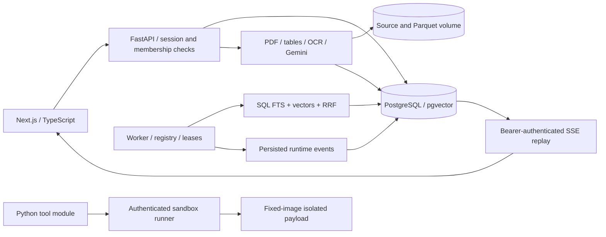

# OmniOps

### Business investigations with inspectable evidence

OmniOps explores how to turn documents, spreadsheets, images and audio into business findings that people can inspect back to their sources. It combines a Next.js workspace with Python ingestion, PostgreSQL retrieval, evidence provenance and a constrained tool runtime.

**Status: engineering prototype, not production-ready.** An adversarial audit found important integration and durability defects. The implementation, passing checks and unresolved failures are documented together in the [final audit](PHASE_7_FINAL_AUDIT.md).

[Engineering walkthrough](docs/ENGINEERING.md) · [Local setup](#run-locally) · [Verification](#verification) · [Operations](OPERATIONS.md) · [Audit](PHASE_7_FINAL_AUDIT.md)


*Actual application screenshot using authored UI QA data. It shows the source/composer interface, not a successful autonomous investigation or customer results.*

## The engineering problem

A useful AI analysis interface needs more than generated prose. It needs identifiable sources, explicit extraction failures, constrained execution, authorization and a way to recover progress without losing or duplicating state. OmniOps implements these building blocks and tests the places where they can fail.

| Area | Implemented work | Current boundary |
| --- | --- | --- |
| Retrieval | PostgreSQL FTS and pgvector candidates, SQL workspace/source filters, reciprocal rank fusion | Semantic quality evaluation needs a compatible embedding credential; production index-use performance is unproven |
| Multimodal ingestion | Native PDF text, Tesseract OCR, Gemini vision/transcription, source coordinates and provider provenance | Capabilities report unavailable providers explicitly; accuracy is not benchmarked |
| Evidence | Seven-stage source-to-recommendation model and reference-validation helpers | Audit found nested validation and deletion-invalidation defects |
| Runtime | Registry validation, bounded attempts, leases, persisted events, cancellation and replay | Default worker only executes retrieval; planner/synthesis integration and fencing need correction |
| Security | Rotating refresh sessions, memory-only browser access tokens, membership checks, centralized SSRF policy | Application filtering has no PostgreSQL RLS defense; audit lists remaining weaknesses |
| Sandbox | Authenticated runner, fixed execution image, non-root payloads, no network, resource limits | Production requires an independently isolated runner host |
| Frontend | Responsive workspace, source previews, lineage/report views, authenticated SSE, accessible native dialogs | Actual default-worker completion currently violates the report contract |

## Architecture



The default worker currently registers retrieval only. The provider planning, synthesis, SQL, Python and web modules are not a completed end-to-end autonomous agent. See the [code tour and design tradeoffs](docs/ENGINEERING.md) for the exact boundaries.

**Stack:** Python 3.12, FastAPI, async SQLAlchemy, Alembic, PostgreSQL/pgvector, DuckDB/Parquet, Pydantic, Gemini, Tesseract, Next.js, React, TypeScript, Tailwind and Docker.

## Run locally

The smallest setup supports account/workspace/source exploration using SQLite. It does not demonstrate PostgreSQL hybrid retrieval, OCR without Tesseract, or sandbox execution without a runner. Use non-sensitive sample files while the audit blockers remain open.

Clone the repository and create a backend environment:

```bash
git clone https://github.com/sohaib-0897/OmniOps.git
cd OmniOps/backend
python -m venv .venv
```

Activate it with `source .venv/bin/activate` on Linux/macOS or `.venv\Scripts\Activate.ps1` in PowerShell, then:

```bash
python -m pip install -r requirements.txt
python -m uvicorn app.main:app --reload --port 8000
```

Without a local `.env`, development defaults select SQLite. If you already have configuration, review it before starting. The root [.env.example](.env.example) is a configuration reference; do not blindly copy production values into the development setup. Settings read `.env` from the process working directory.

In a second terminal, from the repository root:

```bash
cd frontend
npm ci
npm run dev
```

Open [localhost:3000](http://localhost:3000), register an account and create a workspace. API docs are at [localhost:8000/docs](http://localhost:8000/docs). Use port 3000 for the default CORS configuration. Missing provider credentials produce explicit unavailable/failure states; adding a key does not fix the default agent integration defect.

For PostgreSQL, set `DATABASE_URL` to a PostgreSQL/pgvector database and run `alembic -c alembic.ini upgrade head` from `backend` before starting the API. [OPERATIONS.md](OPERATIONS.md) describes the production deployment topology and external controls. Deployment configuration is a reference, not a release certification. The development runner overlay mounts the Docker socket and must remain local-only.

## Verification

These are the recorded **Phase 7 audit results**, not a claim about the latest hosted CI run:

| Check | Result |
| --- | --- |
| Backend with PostgreSQL enabled | 176 passed, **2 failed**, 0 skipped |
| Deterministic evidence scenarios | 15/15 |
| PostgreSQL retrieval integration | 5 passed |
| Frontend | TypeScript, lint, production build and seven interaction checks passed |
| Live multimodal | Genuine image/audio extraction persisted and retrieved in direct-module probes |
| Fault injection | Reproduced stale finalization, late-commit SSE loss, invalid lineage and file/DB divergence |

The two backend failures are credential-dependent mocked audio fixtures. Passing component tests did not prevent actual integration defects, including a report crash. No hallucination rate, semantic accuracy percentage or production capacity claim is made.

From the root, with the backend environment active:

```bash
python -m pytest backend/tests -q --disable-warnings
python -m evals.runner
```

Set `POSTGRES_TEST_DATABASE_URL` to a **disposable test database** to enable PostgreSQL-specific tests. Audit fault-injection scripts are laboratory tools and must not target production services. See [evidence publication notes](phase7-evidence/README.md) for included and excluded artifacts.

## What the audit changed

The final review attempted to disprove earlier remediation claims. It found that ordinary replay and idempotency tests passed while commit ordering and stale-worker finalization still failed. It also found that an apparently complete report flow was disconnected from the actual worker output.

The next implementation priorities are therefore concrete: connect the real agent and typed report contract, enforce database fencing, make replay commit-safe, repair lineage invalidation and file transactions, and bound metric labels. Publishing this repository makes the implementation reviewable; it does not close those findings.

Historical remediation documents record earlier snapshots. **[PHASE_7_FINAL_AUDIT.md](PHASE_7_FINAL_AUDIT.md) is the authoritative audit verdict for that snapshot.** Publication changes are recorded separately in [PUBLICATION.md](docs/PUBLICATION.md).
