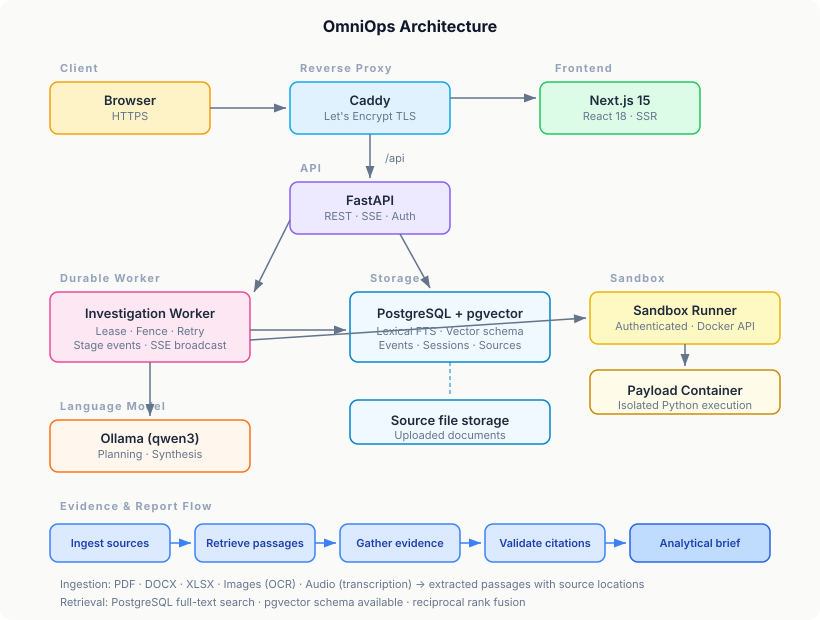
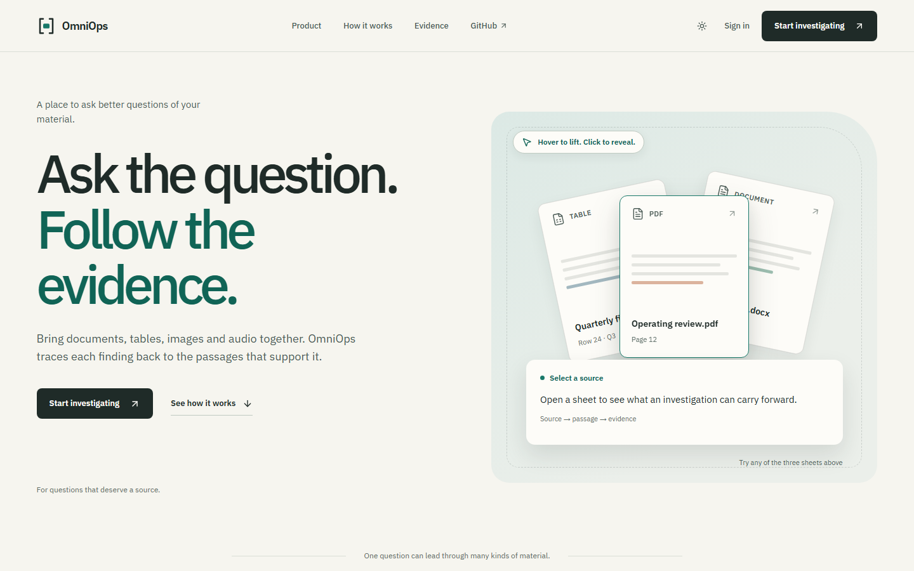
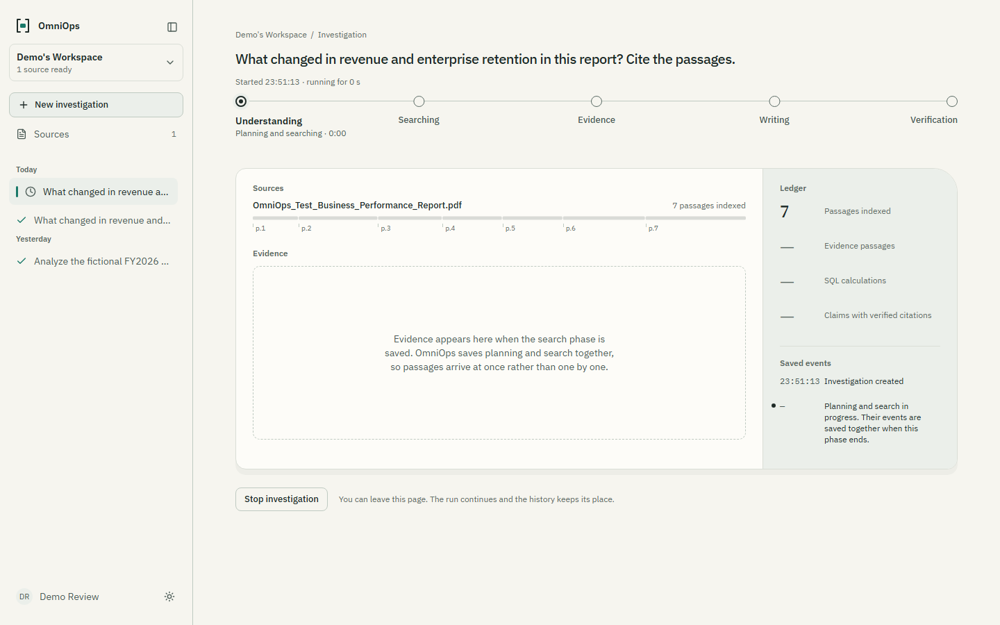
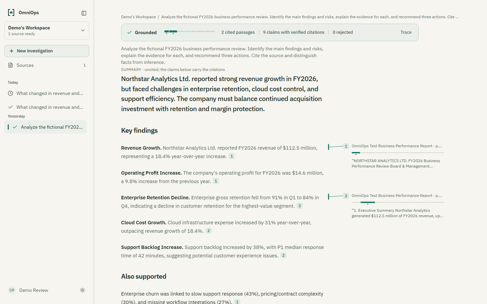
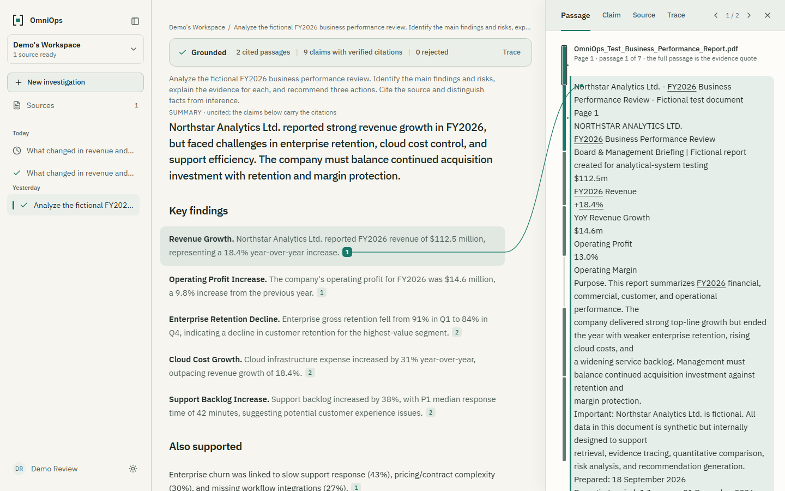

# OmniOps

[](https://github.com/sohaib-0897/OmniOps/actions/workflows/ci.yml)

**Autonomous evidence-backed investigation platform with durable execution.**

Upload documents, spreadsheets, images, and audio. Ask a question. OmniOps plans an investigation, retrieves relevant passages, gathers evidence, validates citations, and produces an analytical brief where every finding traces back to its source.

**[Live Demo →](https://omniops.duckdns.org)**

---

## Architecture

<p align="center">
  
</p>

The system is composed of five layers:

| Layer | Component | Role |
| --- | --- | --- |
| **Reverse proxy** | Caddy | Automatic HTTPS via Let's Encrypt, routes `/api` to FastAPI and everything else to Next.js |
| **Frontend** | Next.js 15 (React 18) | Server-rendered UI, SSE event stream, workspace and evidence inspector |
| **API** | FastAPI | REST endpoints, authentication (JWT + refresh rotation), source upload, SSE broadcast |
| **Worker** | Durable investigation worker | Lease-based claiming, fenced execution, stage events, retry with idempotency |
| **Storage** | PostgreSQL + pgvector | Full-text search, vector schema, runtime events, sessions, sources |
| **Sandbox** | Authenticated runner + payload container | Isolated Python execution for calculations, no Docker socket on the backend |
| **LLM** | Ollama (configurable) | Planning and synthesis; currently `qwen3:1.7b` on the live deployment |

---

## How an investigation works

1. **Upload sources** — PDF, DOCX, XLSX, images, and audio are ingested. Text, tables, and source locations are extracted. Images use OCR (Tesseract); audio uses a configured transcription provider.
2. **Ask a question** — The worker claims the investigation with a durable lease and asks the language model for a plan.
3. **Retrieve passages** — PostgreSQL full-text search finds relevant passages across all workspace sources. The pgvector schema supports semantic retrieval when an embedding provider is configured.
4. **Gather evidence** — The worker executes retrieval and calculation tools, records observations, and builds evidence chains. Calculations run in an isolated sandbox container.
5. **Validate citations** — Citation integrity and quoted text are checked against the source passages. This validates reference accuracy, not the truth of a model's interpretation.
6. **Produce the brief** — An analytical brief is saved with claims, citations, passages, source references, and calculation provenance. Every finding links back to its evidence.

Stage events are persisted to PostgreSQL and broadcast via SSE. The browser reconnects and replays from the last seen event, so work resumes after a connection drop or worker restart.

---

## Durable worker and runtime

The investigation worker is designed for reliability:

- **Lease-based claiming** — A worker acquires an exclusive lease on an investigation. If the worker dies, the lease expires and another worker can recover the work.
- **Fenced execution** — Each lease carries a fence token. Operations check the token before committing, preventing stale workers from corrupting state.
- **Stage persistence** — Every stage transition (planning → retrieval → analysis → validation) is committed to PostgreSQL before proceeding.
- **SSE event replay** — Runtime events are stored in the database. Clients reconnect with `Last-Event-ID` and receive the complete history, not just events after reconnection.
- **Retry with idempotency** — Retried operations check whether their effect was already committed, avoiding duplicate work.
- **Graceful shutdown** — Workers release their leases on SIGTERM, allowing immediate failover.

---

## Evidence and citation model

OmniOps maintains a seven-stage evidence lineage:

```
Source → Extraction → Passage → Retrieval → Observation → Evidence → Claim
```

Each claim in the analytical brief carries citations that reference specific passages. The citation validator checks:

- The cited passage exists in the workspace
- The quoted text appears in that passage
- The source location (page, section, row) is accurate

This validates **reference integrity**, not factual correctness. The system does not independently verify whether a model's interpretation of a passage is true. No hallucination rate or factual precision metric is currently measured.

---

## Production deployment

The live deployment runs on an **Oracle Cloud ARM64 VM** with **Ubuntu 24.04**:

| Component | Detail |
| --- | --- |
| Orchestration | Docker Compose (`docker-compose.prod.yml`) |
| Reverse proxy | Caddy with automatic Let's Encrypt HTTPS |
| Frontend | Next.js 15, server-rendered |
| API | FastAPI, 2 replicas behind Caddy |
| Worker | Durable investigation worker |
| Database | PostgreSQL 16 + pgvector extension |
| Language model | Ollama `qwen3:1.7b` (private, on-VM) |
| Sandbox | Authenticated runner with isolated payload containers |
| TLS | Automatic via Caddy; HSTS termination is external |

**Current retrieval status:**

- ✅ Lexical retrieval (PostgreSQL full-text search): **working**
- ⬚ Semantic embeddings (pgvector): **not currently active** — the vector schema and retrieval code exist, but the free deployment does not have a configured embedding provider

The deployment guide is in [DEPLOY_UBUNTU.md](DEPLOY_UBUNTU.md). The operational runbook is in [OPERATIONS.md](OPERATIONS.md).

---

## Product screenshots



| Investigation | Completed brief |
| --- | --- |
|  |  |



Home, Sources, sign in, and mobile views are in [the screenshot directory](docs/screenshots/).

---

## Tech stack

| Layer | Technology |
| --- | --- |
| Frontend | Next.js 15, React 18, TypeScript, Tailwind CSS 3 |
| API | FastAPI, Pydantic, async SQLAlchemy, asyncpg |
| Database | PostgreSQL 16, pgvector, Alembic migrations |
| Auth | JWT access (15 min), HttpOnly refresh cookie, session rotation, replay-family revocation |
| Ingestion | PyMuPDF, python-docx, openpyxl, Tesseract OCR, Pillow |
| LLM | Provider-agnostic (Ollama, Gemini); currently Ollama on deployment |
| Sandbox | Docker-based isolated runner; backend has no Docker socket |
| Observability | Prometheus-format metrics, JSON request logs, request correlation, health/readiness endpoints |
| CI | GitHub Actions — backend tests, frontend typecheck, lint, build |

---

## Testing

```bash
# Backend regression tests (needs PostgreSQL + POSTGRES_TEST_DATABASE_URL)
python -m pytest backend/tests -q --disable-warnings

# Frontend
cd frontend
npx tsc --noEmit
npm run lint
npm run build
cd ..

# Deterministic authored evaluation scenarios
python -m evals.runner

# Frontend UI tests
node scripts/ui_frontend_tests.cjs
```

See [CI workflow](.github/workflows/ci.yml), the [reproducibility audit](docs/REPRODUCIBILITY_AUDIT.md), and [frontend revamp verification](FRONTEND_REVAMP.md) for scope and actual results. Factual precision, citation precision, and hallucination rate remain `NOT_MEASURED`.

---

## Current limitations

- **Citation validation checks reference integrity and quoted text** — it does not prove that a model's interpretation is true. No independent real-world accuracy or hallucination rate is measured.
- **Semantic retrieval is not evaluated** — a compatible live embedding credential is not available on the free deployment. Lexical PostgreSQL retrieval remains available without embeddings.
- **Vision and audio require external providers** — a readiness capability label does not establish their accuracy.
- **The local runner shares the host Docker control plane** — dedicated runner hosting remains deployment work.
- **Python dependencies use lower bounds** rather than a lockfile; future resolver runs should be checked.
- **Metrics are per-process**, not a shared aggregation system.
- **PostgreSQL RLS is not enabled** — application SQL filtering is authoritative.
- **TLS/HSTS termination is external** to the application containers.

---

## Repository layout

| Path | Purpose |
| --- | --- |
| `backend/app/` | API, ingestion, retrieval, evidence validation, worker, and providers |
| `backend/alembic/` | Database migrations |
| `frontend/src/` | Public story, authentication, workspace, and API/SSE client |
| `docker/`, `docker-compose*.yml` | Images and deployment profiles |
| `backend/tests/`, `evals/`, `scripts/` | Regression tests, authored scenarios, and operational probes |
| `docs/` | Engineering walkthrough, deployment guide, screenshots |

## Further reading

- [Engineering walkthrough](docs/ENGINEERING.md) — code paths, retrieval internals, and tradeoffs
- [Deployment guide](DEPLOY_UBUNTU.md) — Ubuntu 24.04 ARM64 production setup
- [Operations runbook](OPERATIONS.md) — health checks, backup, migration, incident response
- [Phase 6 remediation](PHASE_6_REMEDIATION.md) — security hardening and platform closure

## License

No project license is present in this repository.
