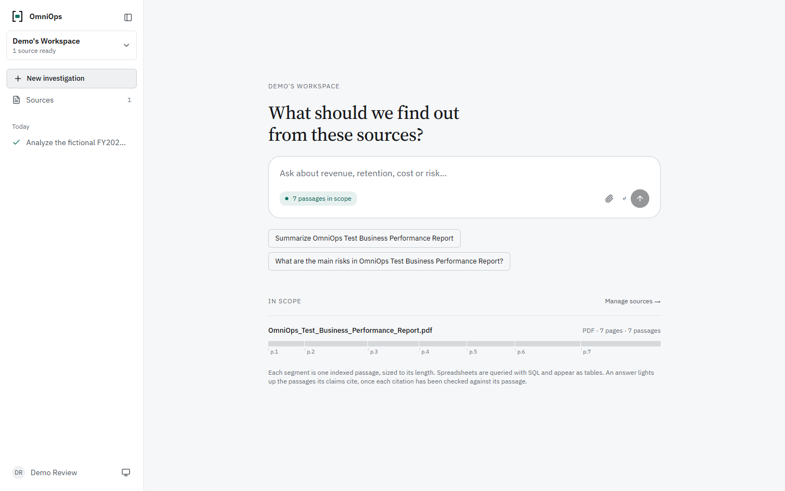
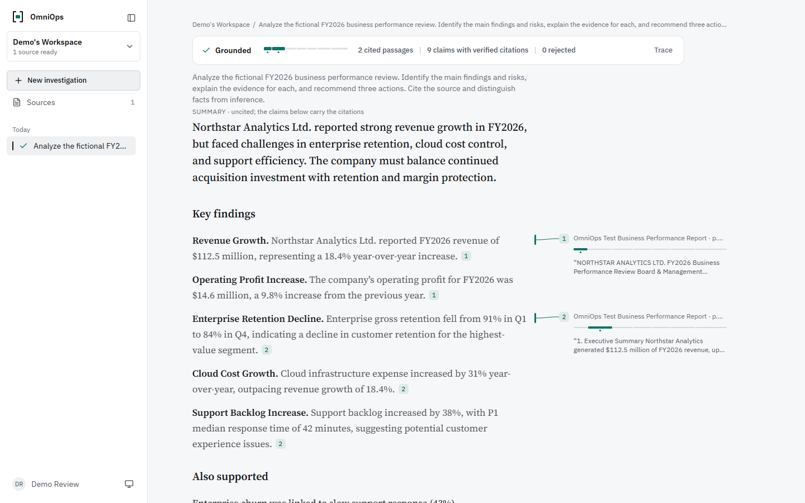
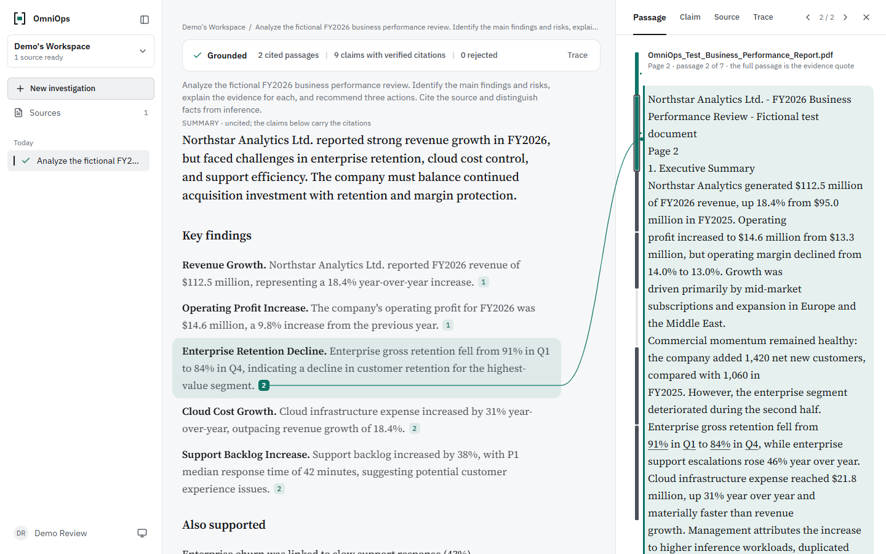
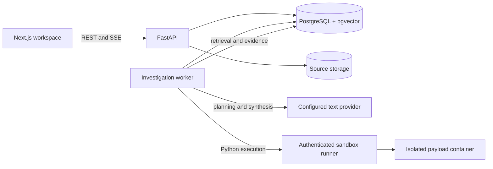

# OmniOps

OmniOps is a source grounded investigation workspace for business documents. It ingests files, retrieves relevant passages, runs a persisted investigation, and presents a brief with links back to the source. The engineering focus is on inspectable evidence, recovery after worker interruption, and explicit failure when a provider or source is unavailable.

The application has a Next.js interface, a FastAPI API, a separate worker, PostgreSQL with pgvector, and an authenticated container runner for Python calculations. Planning and synthesis use a configured text model; they are not deterministic accuracy guarantees.

## Screenshots

Captured from one local investigation of an [authored fictional PDF](docs/demo/OmniOps_Test_Business_Performance_Report.pdf) on 2026-09-27 at 1440 × 900. The runtime view shows the writing stage; the other views show its saved result. Citation checks establish source linkage and quote matching, not the truth of the conclusion.

**Investigation runtime.** The workspace shows the stage timeline, six retrieved evidence passages, and saved events.



**Completed brief.** Findings carry citation markers and passage sidenotes.



**Citation inspector.** Selecting a finding opens the full cited passage and its location in the source.



## Engineering highlights

| Problem | Implementation |
| --- | --- |
| Recover work after a worker interruption | Investigation state, attempts, leases, and events are stored in PostgreSQL. Lease fencing prevents a stale worker from finalizing another worker's run. |
| Retrieve within a workspace | SQL filters candidates by workspace before combining PostgreSQL full text and optional pgvector results with reciprocal rank fusion. Lexical search remains available when embeddings are unavailable. |
| Make conclusions inspectable | Evidence records retain quotes and source locations. Claim validation resolves cited evidence through its chunk, source, investigation, and workspace; calculation records carry a canonical reproducibility hash. |
| Execute calculations outside the API process | The worker calls an authenticated runner. Its disposable payload container has no network access and has resource limits; the API container has no Docker socket. |
| Reconnect to a running investigation | Database events support SSE replay by cursor. The frontend uses bearer headers for the stream and deduplicates replayed events. |

The [engineering walkthrough](docs/ENGINEERING.md) links these paths to the relevant code and explains their tradeoffs.

## Architecture


```mermaid
flowchart LR
    UI[Next.js workspace] -->|REST and SSE| API[FastAPI]
    API --> DB[(PostgreSQL + pgvector)]
    API --> Files[(Source storage)]
    Worker[Investigation worker] --> DB
    Worker -->|planning and synthesis| LLM[Configured text provider]
    Worker -->|retrieval and evidence| DB
    Worker -->|Python execution| Runner[Authenticated sandbox runner]
    Runner --> Payload[Isolated payload container]
```

The API accepts an upload and stores a source record. Ingestion extracts text and source locations; supported media can use OCR or configured multimodal providers. The worker claims an investigation, asks the text provider for a plan, dispatches registered retrieval or calculation tools, records observations and evidence, then validates and persists the brief. The browser reads saved state and events, including after reconnecting. [Runtime](backend/app/agent/service.py), [retrieval](backend/app/rag/hybrid_search.py), and [evidence validation](backend/app/evidence/validator.py) are the primary implementation entry points.

## Verified results

These checks were run on 2026-09-27 from an isolated checkout containing the changes in this review:

| Check | Result | Scope |
| --- | --- | --- |
| `python -m pytest tests -q --disable-warnings` | 245 passed, 0 skipped | Run in `backend/` against a fresh, migrated pgvector test database with `POSTGRES_TEST_DATABASE_URL` set. |
| `node --test scripts/ui_frontend_tests.cjs` | 41 passed | Frontend component and behavior checks. |
| `python -m evals.runner` | 15/15 scenarios passed | Authored deterministic scenarios; factual precision, citation precision, and hallucination rate remain `NOT_MEASURED`. |
| `npx tsc --noEmit`, `npm run lint`, `npm run build` | Passed | Run in `frontend/`; Next.js 15.5.25 build completed. |
| Local application | Ready and HTTP 200 | Fresh isolated Compose stack: database, pgvector, migration, runner, and Ollama readiness checks reported ready. |
| Sample investigation | Completed | A fresh authored text source became ready; the worker saved a brief with five claims. The screenshots above show a separate completed PDF run with nine cited claims. |

The [Phase 7 evidence index](phase7-evidence/README.md) and [final audit](FINAL_AUDIT.md) retain earlier PostgreSQL, migration, security, and failure injection results. Those records describe their own test environments and should not be read as results of the current run.

## Running locally

The supported full stack is [the Ubuntu Compose profile](docker-compose.ubuntu.yml): PostgreSQL, migration job, API, worker, frontend, local sandbox runner, and Caddy on port 80. Docker with Compose and a reachable text provider are required for an investigation. For local Ollama, pull `qwen3:4b` and make it reachable from Docker at `host.docker.internal:11434`.

1. Copy [`.env.example`](.env.example) to `.env`. Set distinct random values for `POSTGRES_PASSWORD`, `SECRET_KEY`, and `SANDBOX_RUNNER_TOKEN`; set `DATABASE_URL` with the same database password. For local HTTP, set `CORS_ORIGINS=["http://localhost"]`, `ALLOW_INSECURE_HTTP=true`, and `COOKIE_SECURE=false`. Keep `LLM_PROVIDER=ollama` and `OLLAMA_BASE_URL=http://host.docker.internal:11434` for the local model.
2. Run:

   ```bash
   docker compose --env-file .env -f docker-compose.ubuntu.yml config --quiet
   docker compose --env-file .env -f docker-compose.ubuntu.yml build backend frontend
   docker compose --env-file .env -f docker-compose.ubuntu.yml build sandbox-image sandbox-runner
   docker compose --env-file .env -f docker-compose.ubuntu.yml up --no-build -d
   ```

3. Open `http://localhost`. Check `http://localhost/api/v1/readiness` before starting an investigation. Upload a source such as the [fictional operating review](docs/demo/fictional-operating-review.txt), wait for **Ready**, and ask a question.

The runner in this local profile controls the Docker daemon. [Deployment notes](DEPLOY_UBUNTU.md) explain the profile and its network boundary. The production profile expects a separately hosted runner.

## Testing and repository map

Run the commands in **Verified results** from the repository root, except backend tests, which run in `backend/`, and the three frontend commands, which run in `frontend/`. PostgreSQL integration tests need a dedicated migrated pgvector test database and `POSTGRES_TEST_DATABASE_URL`; see [.github/workflows/ci.yml](.github/workflows/ci.yml) and the [fresh-checkout audit](docs/REPRODUCIBILITY_AUDIT.md) for that setup.

| Path | Purpose |
| --- | --- |
| `backend/app/` | API, ingestion, retrieval, evidence validation, worker, and provider adapters |
| `backend/alembic/` | Database migrations |
| `frontend/src/` | Workspace interface and API/SSE client |
| `docker/`, `docker-compose*.yml` | Images and deployment profiles |
| `backend/tests/`, `evals/`, `scripts/` | Regression tests, authored scenarios, and operational probes |

## Limitations

- Citation validation checks reference integrity and quoted text; it does not prove that a model's interpretation is true. No independent real world accuracy or hallucination rate is measured.
- Semantic retrieval quality has not been evaluated with a compatible live embedding credential. Lexical PostgreSQL retrieval can operate without embeddings.
- Vision and audio paths require configured external providers; a readiness capability label does not establish their accuracy.
- The local runner shares the host Docker control plane. Dedicated runner hosting and external TLS ingress are deployment work, and GitHub hosted CI was not independently verified during this review.
- Python dependencies use lower bounds rather than a lockfile. The fresh install in this review passed, but a future resolver run can select newer versions and should be checked again.

## License

No project license is present in this repository.
