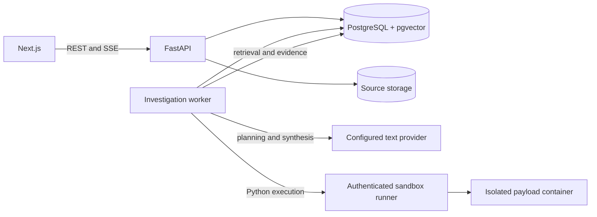

# OmniOps

OmniOps is a workspace for investigating business material. Bring documents, spreadsheets, images, and audio; ask a question; then follow each cited finding through its evidence and passage to the source. Investigations and their events are saved, so work can resume after a connection or worker interruption.

The application uses Next.js, FastAPI, a separate worker, PostgreSQL with pgvector, and an authenticated container runner for Python calculations. Planning and synthesis use a configured text model; they are not deterministic accuracy guarantees.

## Product screenshots

The public story uses labelled, illustrative source sheets and passages. Authenticated views show saved application data.


| Investigation | Completed brief |
| --- | --- |
|  |  |


Home, Sources, sign in, and mobile views are in [the screenshot directory](docs/screenshots/).

## Key capabilities

- Ingest PDF, DOCX, spreadsheet, image, and audio sources. Extraction status and provider failures are explicit.
- Search workspace passages with PostgreSQL full text and optional pgvector retrieval. Source locations and table context remain inspectable where available.
- Run durable investigations with saved stage events, reconnectable SSE, cancellation, and failure states driven by actual backend activity.
- Inspect claims, citations, passages, source tracks, and calculation provenance in an analytical brief. Verification checks citation integrity and quoted text, not the truth of an interpretation.
- Use a coherent interface across the public story, authentication, Home, Sources, and workspaces. Fresh loads start light; Dark and System are selectable for the current page.
- Register, sign in, recover a password through a one-time expiring link, and manage a revocable session.

## Architecture


```mermaid
flowchart LR
    UI[Next.js] -->|REST and SSE| API[FastAPI]
    API --> DB[(PostgreSQL + pgvector)]
    API --> Files[(Source storage)]
    Worker[Investigation worker] --> DB
    Worker -->|planning and synthesis| LLM[Configured text provider]
    Worker -->|retrieval and evidence| DB
    Worker -->|Python execution| Runner[Authenticated sandbox runner]
    Runner --> Payload[Isolated payload container]
```

The API stores uploaded sources. Ingestion extracts text and source locations; supported media can use OCR or configured multimodal providers. The worker claims an investigation, asks the text provider for a plan, dispatches registered retrieval or calculation tools, records observations and evidence, then validates and saves the brief. The browser reads saved state and events, including after reconnecting. See the [engineering walkthrough](docs/ENGINEERING.md) for code paths and tradeoffs.

## Local development

The supported local stack is [the Ubuntu Compose profile](docker-compose.ubuntu.yml): PostgreSQL, migration job, API, worker, frontend, local sandbox runner, and Caddy on port 80. Docker Compose and a reachable text provider are required for an investigation. For local Ollama, pull `qwen3:4b` and make it reachable from Docker at `host.docker.internal:11434`.

1. Copy [`.env.example`](.env.example) to `.env`. Set distinct random values for `POSTGRES_PASSWORD`, `SECRET_KEY`, and `SANDBOX_RUNNER_TOKEN`; set `DATABASE_URL` with the same database password. For local HTTP set `ENVIRONMENT=development`, `CORS_ORIGINS=["http://localhost"]`, `ALLOW_INSECURE_HTTP=true`, `COOKIE_SECURE=false`, and `PASSWORD_RESET_BASE_URL=http://localhost`. Keep `LLM_PROVIDER=ollama` and `OLLAMA_BASE_URL=http://host.docker.internal:11434` for a local model.
2. Run:

   ```bash
   docker compose --env-file .env -f docker-compose.ubuntu.yml config --quiet
   docker compose --env-file .env -f docker-compose.ubuntu.yml build backend frontend
   docker compose --env-file .env -f docker-compose.ubuntu.yml build sandbox-image sandbox-runner
   docker compose --env-file .env -f docker-compose.ubuntu.yml up --no-build -d
   ```

3. Open `http://localhost`. Check `http://localhost/api/v1/readiness`, upload a source such as the [fictional operating review](docs/demo/fictional-operating-review.txt), wait for **Ready**, and ask a question.

Without SMTP, local password reset writes a private message under the backend's configured `STORAGE_DIR/dev-password-reset-outbox/`. Read the link there; reset tokens never appear in the product UI or logs. Production requires authenticated STARTTLS SMTP and an HTTPS `PASSWORD_RESET_BASE_URL`; the [production Compose profile](docker-compose.prod.yml) requires these settings. Apply the migration head before starting the updated API. The local runner controls the host Docker daemon; [deployment notes](DEPLOY_UBUNTU.md) explain the network boundary and production runner requirements.

## Verification

Run `node scripts/ui_frontend_tests.cjs` from the repository root. From `frontend/`, run `npx tsc --noEmit`, `npm run lint`, and `npm run build`. Backend regression tests run with `python -m pytest backend/tests -q --disable-warnings`; PostgreSQL integration cases need a dedicated migrated pgvector database and `POSTGRES_TEST_DATABASE_URL`. See [CI](.github/workflows/ci.yml), the [reproducibility audit](docs/REPRODUCIBILITY_AUDIT.md), and [frontend revamp verification](FRONTEND_REVAMP.md) for scope and actual results. Deterministic authored scenarios run with `python -m evals.runner`; factual precision, citation precision, and hallucination rate remain `NOT_MEASURED`.

| Path | Purpose |
| --- | --- |
| `backend/app/` | API, ingestion, retrieval, evidence validation, worker, and providers |
| `backend/alembic/` | Database migrations |
| `frontend/src/` | Public story, authentication, workspace, and API/SSE client |
| `docker/`, `docker-compose*.yml` | Images and deployment profiles |
| `backend/tests/`, `evals/`, `scripts/` | Regression tests, authored scenarios, and operational probes |

## Limitations

- Citation validation checks reference integrity and quoted text; it does not prove that a model's interpretation is true. No independent real-world accuracy or hallucination rate is measured.
- Semantic retrieval quality has not been evaluated with a compatible live embedding credential. Lexical PostgreSQL retrieval remains available without embeddings.
- Vision and audio paths require configured external providers; a readiness capability label does not establish their accuracy.
- The local runner shares the host Docker control plane. Dedicated runner hosting and external TLS ingress remain deployment work.
- Python dependencies use lower bounds rather than a lockfile; future resolver runs should be checked.

## License

No project license is present in this repository.
